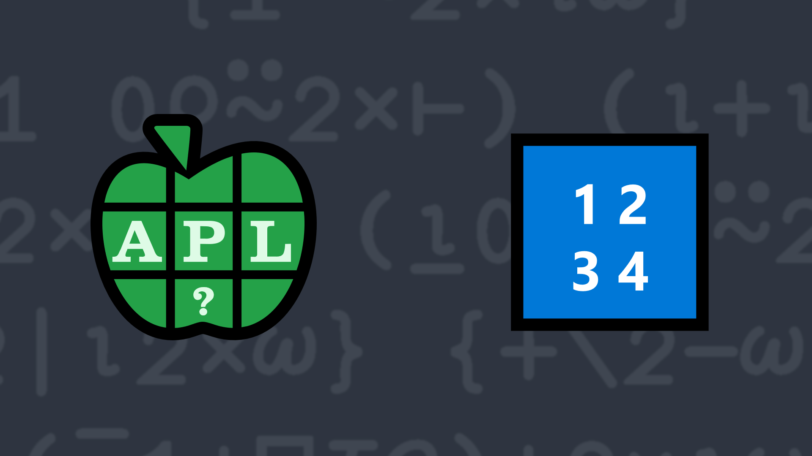

# <span class=s>2013-</span>1: Seems a Bit Odd To Me

Write a function to produce a vector of the first n odd numbers.

### Examples:

```APL
      (your_function) 10
1 3 5 7 9 11 13 15 17 19
      (your_function) 1
1
      (your_function) 0 ⍝ this should return an empty vector
```
<div class="pdiv">
  <code onclick="p_Input.focus()">your_function ← </code><input id="p_Input" autocomplete="off" spellcheck="false" oninput="this.parentElement.querySelector`button`.disabled=false;localStorage.setItem(window.location.pathname,this.value)" onkeypress="subm(event)">
  <button onclick="alert$.next`Testing…`;submitSolution`p`" class="md-button md-button--primary">&#x2714; Test</button>
</div>
<p id="p_Output"></p>
## Solutions
<div onclick="play(this)" title="Video on YouTube" class="yt">

<time>10:31</time>

</div>
<a href="https://chat.stackexchange.com/transcript/52405?m=60343161#60343161" target="_blank" class="md-button md-button--primary">Chat transcript</a>
<a href="https://github.com/abrudz/apl_quest/blob/main/2013/1.apl" target="_blank" class="md-button md-button--primary right">Code on GitHub</a>

<script>
    testCases={"a":["10","20","?50","20+??40","1"],"b":["0"],"f":"{(2×⍳⍵)-1}"}
    p_Input.value=localStorage.getItem(window.location.pathname)
    play=e=>e.outerHTML=`<iframe class="md-header--shadow" src="https://www.youtube.com/embed/Mj4wyLKrBho?list=PLYKQVqyrAEj9wDIUyLDGtDAFTKY38BUMN&autoplay=1" title="<span class=s>2013-</span>1: Seems a Bit Odd To Me (APL Quest 2013-1)" frameborder="0" allow="accelerometer; autoplay; clipboard-write; encrypted-media; gyroscope; picture-in-picture; web-share" referrerpolicy="strict-origin-when-cross-origin" allowfullscreen></iframe>`
</script>
