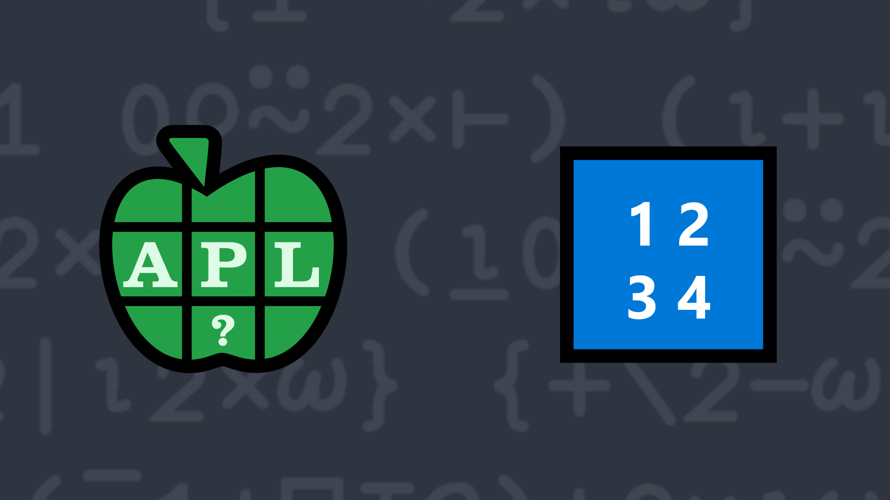

# 1: Seems a Bit Odd To Me

Write a dfn to produce a vector of the first n odd numbers.

### Test cases

```APL
      {your_function} 10
1 3 5 7 9 11 13 15 17 19
      {your_function} 1
1
      {your_function} 0 ⍝ this should return an empty vector
```
<div class="pdiv">
  <code>your_function ← </code><input id="p_Input" autocomplete="off" spellcheck="false">
  <button onclick="alert$.next`Testing…`;submitSolution`p`" class="md-button">&#x2714; Test</button>
</div>
<blockquote id="p_Output"></blockquote>
??? info "Solutions"
    <div onclick="play(this)">
        
        
    </div>
    [Chat transcript](https://chat.stackexchange.com/transcript/52405?m=60343161#60343161) ∙ [Code on GitHub](https://github.com/abrudz/apl_quest/blob/main/2013/1.apl)
<script>
    testCases={"a":["10","20","?50","20+??40","1"],"b":["0"],"f":"{(2×⍳⍵)-1}"}
    play=e=>e.outerHTML=`<iframe width="960" height="540" src="https://www.youtube.com/embed/Mj4wyLKrBho" title="1: Seems a Bit Odd To Me (APL Quest 2013-1)" frameborder="0" allow="accelerometer; autoplay; clipboard-write; encrypted-media; gyroscope; picture-in-picture; web-share" referrerpolicy="strict-origin-when-cross-origin" allowfullscreen></iframe>`
    p_Input.focus()
</script>
