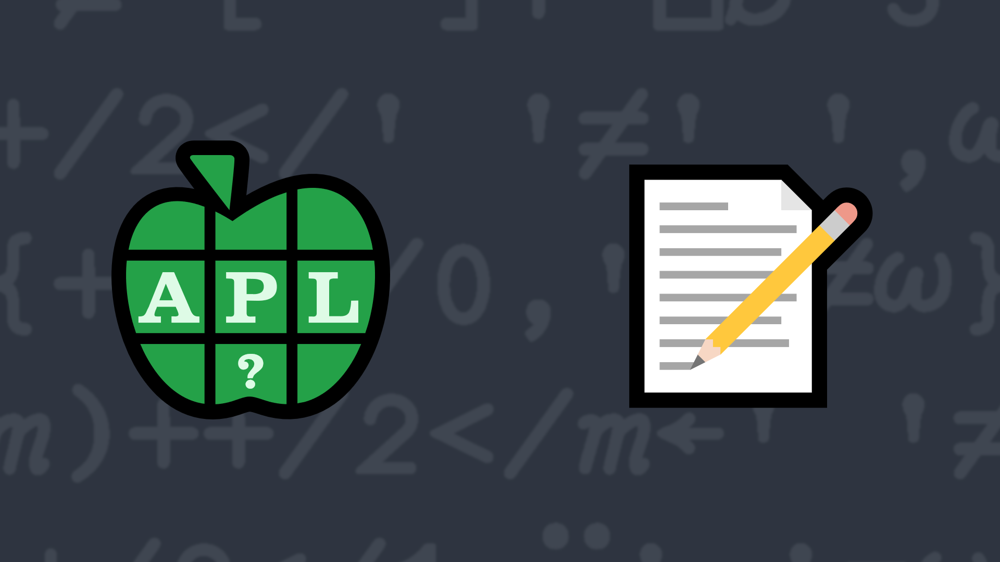

# <span class=s>2013-</span>3: What Is In a Word

Write a dfn which returns the number of words in the given character scalar or vector.

For simplicity's sake, you can consider the space character `' '` to be the only word separator.

### Examples:

```APL
      (your_function) 'Testing one, two, three'
4
      (your_function) '' ⍝ empty vector has no words
0
      (your_function) ' this vector has extra blanks ' ⍝ just counting the blanks won't work
5
```
<div class="pdiv">
  <code onclick="p_Input.focus()">your_function ← </code><input id="p_Input" autocomplete="off" spellcheck="false" oninput="this.parentElement.querySelector`button`.disabled=false;localStorage.setItem(window.location.pathname,this.value)" onkeypress="subm(event)">
  <button onclick="alert$.next`Testing…`;submitSolution`p`" class="md-button md-button--primary">&#x2714; Test</button>
</div>
<p id="p_Output"></p>
## Solutions
<div onclick="play(this)" title="Video on YouTube" class="yt">

<time>21:18</time>

</div>
<a href="https://chat.stackexchange.com/transcript/message/60462122#60462122" target="_blank" class="md-button md-button--primary">Chat transcript</a>
<a href="https://github.com/abrudz/apl_quest/blob/main/2013/3.apl" target="_blank" class="md-button md-button--primary right">Code on GitHub</a>

<script>
    testCases={"a":["'Testing one, two, three'","' this vector has extra blanks '","'a b c d e f g h i j k l m n o p q r s t u v w x y z'"],"b":["' '","''","'    '","(?20)⍴' '","'ABC'","'hyphen-dash'"],"f":"{0.5×+/2≠/(' ',⍵,' ')≠' '}"}
    p_Input.value=localStorage.getItem(window.location.pathname)
    play=e=>e.outerHTML=`<iframe class="md-header--shadow" src="https://www.youtube.com/embed/MgkM2qCPWas?list=PLYKQVqyrAEj9wDIUyLDGtDAFTKY38BUMN&autoplay=1" title="<span class=s>2013-</span>3: What Is In a Word (APL Quest 2013-3)" frameborder="0" allow="accelerometer; autoplay; clipboard-write; encrypted-media; gyroscope; picture-in-picture; web-share" referrerpolicy="strict-origin-when-cross-origin" allowfullscreen></iframe>`
</script>
