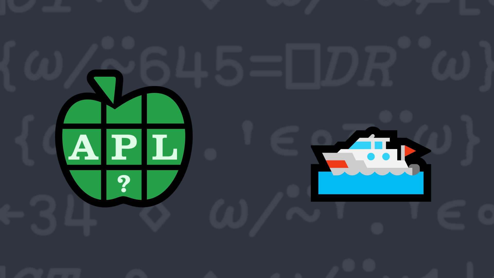

# <span class=s>2013-</span>7: Float Your Boat

Write a dfn which selects the floating point (non-integer) numbers from a numeric vector.

### Examples:

```APL
      (your_function) 14.2 9 ¯3 3.1 0 ¯1.1
14.2 3.1 ¯1.1
      (your_function) 1 3 5 ⍝ should return an empty vector
      
      (your_function) 3.1415
3.1415
```
<div class="pdiv">
  <code onclick="p_Input.focus()">your_function ← </code><input id="p_Input" autocomplete="off" spellcheck="false" oninput="this.parentElement.querySelector`button`.disabled=false;localStorage.setItem(window.location.pathname,this.value)" onkeypress="subm(event)">
  <button onclick="alert$.next`Testing…`;submitSolution`p`" class="md-button md-button--primary">&#x2714; Test</button>
</div>
<p id="p_Output"></p>
## Solutions
<div onclick="play(this)" title="Video on YouTube" class="yt">

<time>22:50</time>

</div>
<a href="https://chat.stackexchange.com/transcript/52405?m=60678893#60678893" target="_blank" class="md-button md-button--primary">Chat transcript</a>
<a href="https://github.com/abrudz/apl_quest/blob/main/2013/7.apl" target="_blank" class="md-button md-button--primary right">Code on GitHub</a>

<script>
    testCases={"a":["14.2 9 ¯3 3.1 0 ¯1.1","?100","?0","?¯1+?10⍴2","1 3 5 6 7 10","?10⍴10"],"b":["1.0","0.0","3.1415","⍬","?¯1+?(10+?10)⍴2"],"f":"{⍵[⍸0≠⍵-⌈⍵]}"}
    p_Input.value=localStorage.getItem(window.location.pathname)
    play=e=>e.outerHTML=`<iframe src="https://www.youtube.com/embed/w5LvImFVi2M?list=PLYKQVqyrAEj9wDIUyLDGtDAFTKY38BUMN&autoplay=1" title="<span class=s>2013-</span>7: Float Your Boat (APL Quest 2013-7)" frameborder="0" allow="accelerometer; autoplay; clipboard-write; encrypted-media; gyroscope; picture-in-picture; web-share" referrerpolicy="strict-origin-when-cross-origin" allowfullscreen></iframe>`
</script>
