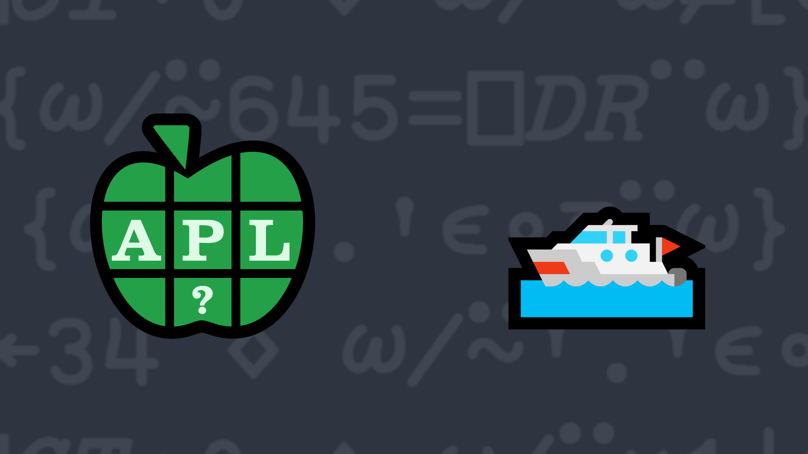

# 7: Float Your Boat

Write a dfn which selects the floating point (non-integer) numbers from a numeric vector.

### Test cases

```APL
      {your_solution} 14.2 9 ¯3 3.1 0 ¯1.1
14.2 3.1 ¯1.1
      {your_solution} 1 3 5 ⍝ should return an empty vector
      
      {your_solution} 3.1415
3.1415
```
<div class="pdiv">
  <code>your_function ← </code><input id="p_Input" autocomplete="off" spellcheck="false">
  <button onclick="alert$.next`Testing…`;submitSolution`p`" class="md-button">&#x2714; Test</button>
</div>
<blockquote id="p_Output"></blockquote>
??? info "Solutions"
    <div onclick="play(this)">
        
        
    </div>

    [Chat transcript](https://chat.stackexchange.com/transcript/52405?m=60678893#60678893)&emsp;∙&emsp;[Code on GitHub](https://github.com/abrudz/apl_quest/blob/main/2013/7.apl)
<script>
    testCases={"a":["14.2 9 ¯3 3.1 0 ¯1.1","?100","?0","?¯1+?10⍴2","1 3 5 6 7 10","?10⍴10"],"b":["1.0","0.0","3.1415","⍬","?¯1+?(10+?10)⍴2"],"f":"{⍵[⍸0≠⍵-⌈⍵]}"}
    play=e=>e.outerHTML=`<iframe src="https://www.youtube.com/embed/w5LvImFVi2M" title="7: Float Your Boat (APL Quest 2013-7)" frameborder="0" allow="accelerometer; autoplay; clipboard-write; encrypted-media; gyroscope; picture-in-picture; web-share" referrerpolicy="strict-origin-when-cross-origin" allowfullscreen></iframe>`
    p_Input.focus()
</script>
