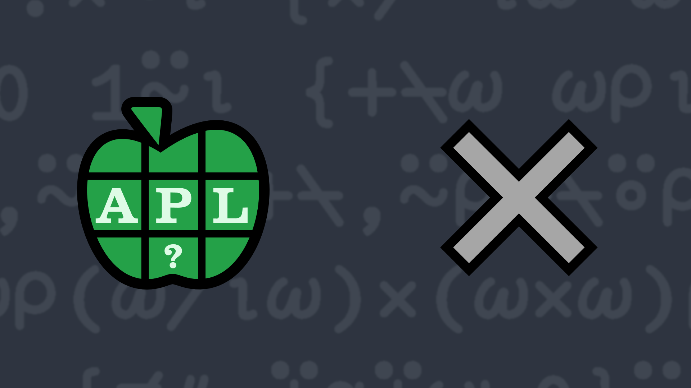

# <span class=s>2013-</span>8: Go Forth And Multiply

Write a dfn which produces a multiplication table.

### Test cases

```APL
      (your_function) 5
1 2  3  4  5
2 4  6  8  10
3 6  9  12 15
4 8  12 16 20
5 10 15 20 25
      (your_function) 1 ⍝ should return a 1×1 matrix
1
      (your_function) 0 ⍝ should return a 0×0 matrix
```
<div class="pdiv">
  <code onclick="p_Input.focus()">your_function ← </code><input id="p_Input" autocomplete="off" spellcheck="false" oninput="this.parentElement.querySelector`button`.disabled=false;localStorage.setItem(window.location.pathname,this.value)" onkeypress="subm(event)">
  <button onclick="alert$.next`Testing…`;submitSolution`p`" class="md-button md-button--primary">&#x2714; Test</button>
</div>
<blockquote id="p_Output"></blockquote>
## Solutions
<div onclick="play(this)" title="Video on YouTube" class="yt">


</div>
<a href="https://chat.stackexchange.com/transcript/52405?m=60733991#60733991" target="_blank" class="md-button md-button--primary">Chat transcript</a>
<a href="https://github.com/dyalog/apl.quest/blob/main/2013/8.apl" target="_blank" class="md-button md-button--primary right">Code on GitHub</a>

<script>
    testCases={"a":["5","12","10","1","?10","5+?10"],"b":["0","?10"],"f":"{{⍵∘.×⍵}⍳⍵}"}
    p_Input.value=localStorage.getItem(window.location.pathname)
    play=e=>e.outerHTML=`<iframe src="https://www.youtube.com/embed/O_l-nJYmDrs?list=PLYKQVqyrAEj9wDIUyLDGtDAFTKY38BUMN&autoplay=1" title="<span class=s>2013-</span>8: Go Forth And Multiply (APL Quest 2013-8)" frameborder="0" allow="accelerometer; autoplay; clipboard-write; encrypted-media; gyroscope; picture-in-picture; web-share" referrerpolicy="strict-origin-when-cross-origin" allowfullscreen></iframe>`
</script>
