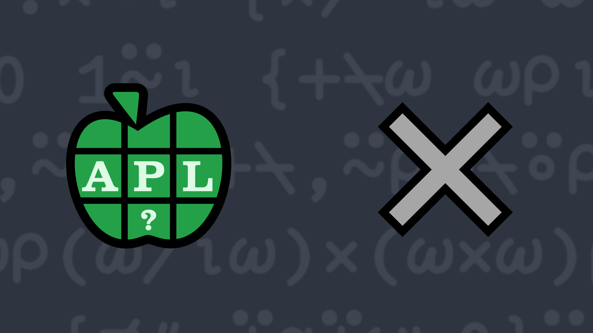

# 8: Go Forth And Multiply

Write a dfn which produces a multiplication table.

### Test cases

```APL
      {your_solution} 5
1 2  3  4  5
2 4  6  8  10
3 6  9  12 15
4 8  12 16 20
5 10 15 20 25
      {your_solution} 1 ⍝ should return a 1×1 matrix
1
      {your_solution} 0 ⍝ should return a 0×0 matrix
```
<div class="pdiv">
  <code>your_function ← </code><input id="p_Input" autocomplete="off" spellcheck="false">
  <button onclick="alert$.next`Testing…`;submitSolution`p`" class="md-button">&#x2714; Test</button>
</div>
<blockquote id="p_Output"></blockquote>
??? info "Solutions"
    <div onclick="play(this)">
        
        
    </div>
    [Chat transcript](https://chat.stackexchange.com/transcript/52405?m=60733991#60733991) ∙ [Code on GitHub](https://github.com/abrudz/apl_quest/blob/main/2013/8.apl)
<script>
    testCases={"a":["5","12","10","1","?10","5+?10"],"b":["0","?10"],"f":"{{⍵∘.×⍵}⍳⍵}"}
    play=e=>e.outerHTML=`<iframe src="https://www.youtube.com/embed/O_l-nJYmDrs&list=PLYKQVqyrAEj9wDIUyLDGtDAFTKY38BUMN&autoplay=1" title="Seems a Bit Odd To Me (APL Quest 2013-1)" frameborder="0" allow="accelerometer; autoplay; clipboard-write; encrypted-media; gyroscope; picture-in-picture; web-share" referrerpolicy="strict-origin-when-cross-origin" allowfullscreen="" width="1920" height="1080"></iframe>`
    p_Input.focus()
</script>
