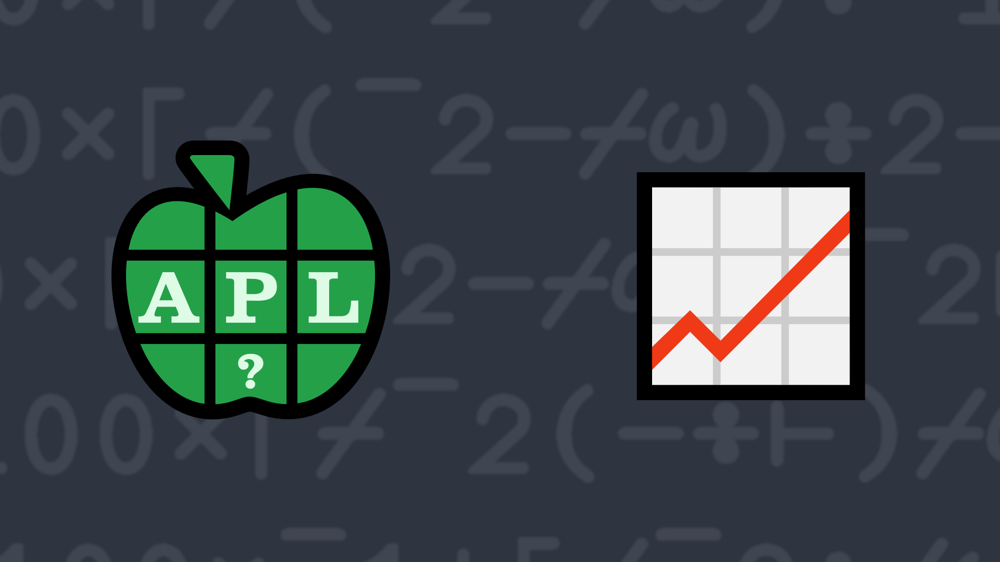

# <span class=s>2014-</span>10: Sales Are Up

Given a vector representing monthly sales figures, write a function that returns the greatest percent month to
month increase.

### Examples:

```APL
      (your_function) 80 100 120 140
25
      (your_function) 123 123 123
0
      (your_function) 101 102 114 117 101 110 102 111 118 115 124 122
11.76470588
      (your_function) 200 180 160 140 120
¯10
```
<div class="pdiv">
  <code onclick="p_Input.focus()">your_function ← </code><input id="p_Input" autocomplete="off" spellcheck="false" oninput="this.parentElement.querySelector`button`.disabled=false;localStorage.setItem(window.location.pathname,this.value)" onkeypress="subm(event)">
  <button onclick="alert$.next`Testing…`;submitSolution`p`" class="md-button md-button--primary">&#x2714; Test</button>
</div>
<p id="p_Output"></p>
## Solutions
<div onclick="if(event.target.tagName!='A'){play(this)}" title="Video on YouTube" class="yt">

<div>Click to load video from YouTube. This will enable YouTube tracking. <a href="https://support.google.com/youtube/answer/10364219" target="_blank" rel="noopener">YouTube Privacy Information</a></div>
<time>10:59</time>

</div>
<a href="https://chat.stackexchange.com/transcript/52405?m=61385753#61385753" target="_blank" class="md-button md-button--primary">Chat transcript</a>
<a href="https://github.com/abrudz/apl_quest/tree/main/2014" target="_blank" class="md-button md-button--primary right">Code on GitHub</a>

<script>
    testCases={"a":["80 100 120 140","101 102 114 117 101 110 102 111 118 115 124 122","1 2 3 4 5 6 7 8 9 10","?(10+?15)⍴100"],"b":["123 123 123","400 200 100 50 25","10⍴?100","2⍴?100"],"f":"{{100×(⍵[⊃⍒⍵])-1}÷1↓⌽1↓(1,⍵)÷(⍵,1)}"}
    p_Input.value=localStorage.getItem(window.location.pathname)
    play=e=>e.outerHTML=`<iframe class="md-header--shadow" src="https://www.youtube.com/embed/JvvaNQ0DO4Q?list=PLYKQVqyrAEj9wDIUyLDGtDAFTKY38BUMN&autoplay=1" title="<span class=s>2014-</span>10: Sales Are Up (APL Quest 2014-10)" frameborder="0" allow="accelerometer; autoplay; clipboard-write; encrypted-media; gyroscope; picture-in-picture; web-share" referrerpolicy="strict-origin-when-cross-origin" allowfullscreen></iframe>`
</script>
