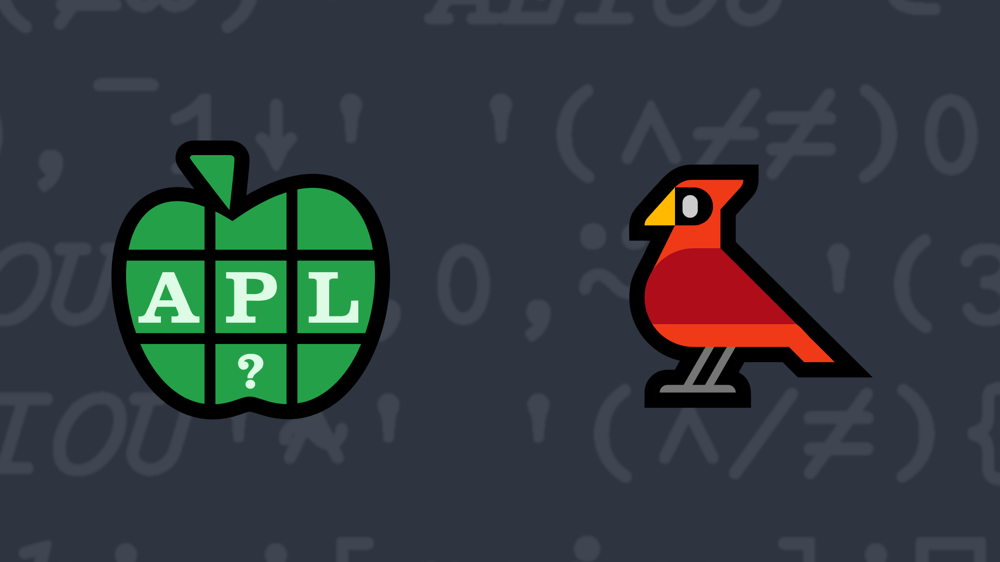

# <span class=s>2014-</span>2: How Tweet It Is

Twitter messages have a 140 character limit; what if the limit was even shorter? One way to shorten the
message yet retain most readability is to remove interior vowels from its words. Write a dfn which takes a
character vector and removes the interior vowels from each word.

### Test cases:

```APL
      (your_function) 'if you can read this, it worked!'
if yu cn rd ths, it wrkd!
      (your_function) 'APL is REALLY cool'
APL is RLLY cl
      (your_function) '' ⍝ an empty vector arg should return an empty vector
 
      (your_function) 'a' ⍝ should work with a single character message
a
```
<div class="pdiv">
  <code onclick="p_Input.focus()">your_function ← </code><input id="p_Input" autocomplete="off" spellcheck="false" oninput="this.parentElement.querySelector`button`.disabled=false;localStorage.setItem(window.location.pathname,this.value)" onkeypress="subm(event)">
  <button onclick="alert$.next`Testing…`;submitSolution`p`" class="md-button md-button--primary">&#x2714; Test</button>
</div>
<blockquote id="p_Output"></blockquote>
## Solutions
<div onclick="play(this)" title="Video on YouTube" class="yt">


</div>
<a href="https://chat.stackexchange.com/transcript/52405?m=60949514#60949514" target="_blank" class="md-button md-button--primary">Chat transcript</a>
<a href="https://github.com/dyalog/apl.quest/blob/main/2014/2.apl" target="_blank" class="md-button md-button--primary right">Code on GitHub</a>

<script>
    testCases={"a":["'APL is REALLY cool'","'if you can read this, it worked!'","'Hello World'","'Dyalog APL'","'The quick brown fox jumps over the lazy dog,'"],"b":["''","' '","'a'","'aaaaaaaaaaaaaaa'","'AEIOU'","'aeiou'","⎕A","(⎕A)[?20⍴26]","(⎕A,'    ')[?(30+?20)⍴30]"],"f":"{⌽1↓⌽(⍵,' ')[⍸0=+/(⍳≢⍵,' ')∘.={((⍸⍵∊'AEIOU'){⍺[⍸(≢⍵)=+/2≤|⍺∘.-⍵]}⍸26=+/⍵∘.≠⎕A)[⍸2=+⌿1 (≢⍵)∘.≠{(⍸⍵∊'AEIOU'){⍺[⍸(≢⍵)=+/2≤|⍺∘.-⍵]}⍸26=+/⍵∘.≠⎕A}⍵]}(1⎕C⍵,' ')]}"}
    p_Input.value=localStorage.getItem(window.location.pathname)
    play=e=>e.outerHTML=`<iframe src="https://www.youtube.com/embed/3X3l76njwfs?list=PLYKQVqyrAEj9wDIUyLDGtDAFTKY38BUMN&autoplay=1" title="<span class=s>2014-</span>2: How Tweet It Is (APL Quest 2014-2)" frameborder="0" allow="accelerometer; autoplay; clipboard-write; encrypted-media; gyroscope; picture-in-picture; web-share" referrerpolicy="strict-origin-when-cross-origin" allowfullscreen></iframe>`
</script>
