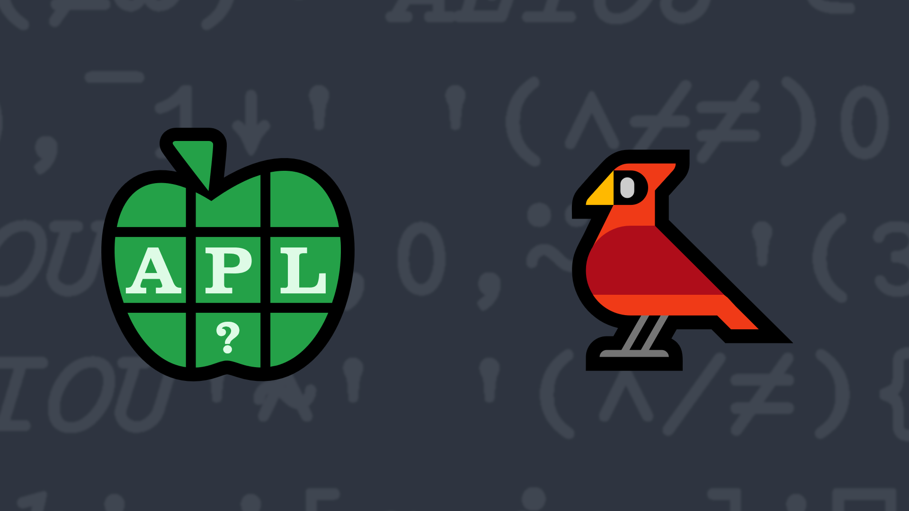

# 2: How Tweet It Is

Twitter messages have a 140 character limit; what if the limit was even shorter? One way to shorten the
message yet retain most readability is to remove interior vowels from its words. Write a dfn which takes a
character vector and removes the interior vowels from each word.

### Test cases:

```APL
      {your_solution} 'if you can read this, it worked!'
if yu cn rd ths, it wrkd!
      {your_solution} 'APL is REALLY cool'
APL is RLLY cl
      {your_solution} '' ⍝ an empty vector arg should return an empty vector
 
      {your_solution} 'a' ⍝ should work with a single character message
a
```
<div class="pdiv">
  <code>your_function ← </code><input id="p_Input" autocomplete="off" spellcheck="false">
  <button onclick="alert$.next`Testing…`;submitSolution`p`" class="md-button">&#x2714; Test</button>
</div>
<blockquote id="p_Output"></blockquote>
??? info "Solutions"
    <div onclick="play(this)">
        
        
    </div>

    [Chat transcript](https://chat.stackexchange.com/transcript/52405?m=60949514#60949514)&emsp;∙&emsp;[Code on GitHub](https://github.com/abrudz/apl_quest/blob/main/2014/2.apl)
<script>
    testCases={"a":["'APL is REALLY cool'","'if you can read this, it worked!'","'Hello World'","'Dyalog APL'","'The quick brown fox jumps over the lazy dog,'"],"b":["''","' '","'a'","'aaaaaaaaaaaaaaa'","'AEIOU'","'aeiou'","⎕A","(⎕A)[?20⍴26]","(⎕A,'    ')[?(30+?20)⍴30]"],"f":"{⌽1↓⌽(⍵,' ')[⍸0=+/(⍳≢⍵,' ')∘.={((⍸⍵∊'AEIOU'){⍺[⍸(≢⍵)=+/2≤|⍺∘.-⍵]}⍸26=+/⍵∘.≠⎕A)[⍸2=+⌿1 (≢⍵)∘.≠{(⍸⍵∊'AEIOU'){⍺[⍸(≢⍵)=+/2≤|⍺∘.-⍵]}⍸26=+/⍵∘.≠⎕A}⍵]}(1⎕C⍵,' ')]}"}
    play=e=>e.outerHTML=`<iframe src="https://www.youtube.com/embed/3X3l76njwfs" title="2: How Tweet It Is (APL Quest 2014-2)" frameborder="0" allow="accelerometer; autoplay; clipboard-write; encrypted-media; gyroscope; picture-in-picture; web-share" referrerpolicy="strict-origin-when-cross-origin" allowfullscreen></iframe>`
    p_Input.focus()
</script>
