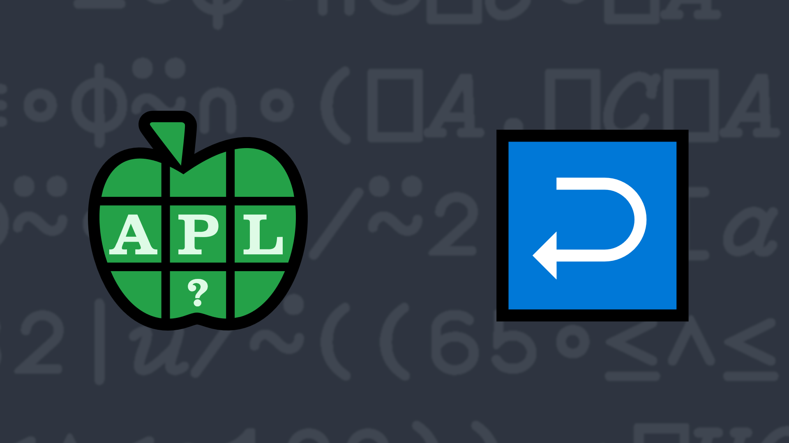

# <span class=s>2014-</span>5: Mirror Mirror

A palindrome is a word or phrase whose letters read the same forwards and backwards. Write a dfn which
returns a 1 if its character vector argument is a palindrome, 0 otherwise. For simplicity's sake, you may
assume that the vector is all one case.

### Examples:

```APL
      (your_function) 'a man, a plan, a canal, panama!'
1
      (your_function) '' ⍝ a phrase of 0 length is a palindrome
1
      (your_function) 'a' ⍝ as is a single letter phrase
1
      (your_function) 'APL' ⍝ APL may be cool, but it's not a palindrome
0
```
<div class="pdiv">
  <code onclick="p_Input.focus()">your_function ← </code><input id="p_Input" autocomplete="off" spellcheck="false" oninput="this.parentElement.querySelector`button`.disabled=false;localStorage.setItem(window.location.pathname,this.value)" onkeypress="subm(event)">
  <button onclick="alert$.next`Testing…`;submitSolution`p`" class="md-button md-button--primary">&#x2714; Test</button>
</div>
<blockquote id="p_Output"></blockquote>
## Solutions
<div onclick="play(this)" title="Video on YouTube" class="yt">

<time>16:31</time>

</div>
<a href="https://chat.stackexchange.com/transcript/52405?m=61119677#61119677" target="_blank" class="md-button md-button--primary">Chat transcript</a>
<a href="https://github.com/abrudz/apl_quest/blob/main/2014/5.apl" target="_blank" class="md-button md-button--primary right">Code on GitHub</a>

<script>
    testCases={"a":["'mirror rorrim'","'a man, a plan, a canal, panama!'","'DYALOG APL'","'racecar'","'a'","⎕A,⌽⎕A"],"b":["''","' '","⎕A[?26]","('abc')[?3⍴3]"],"f":"{{{⍵≡⌽⍵}⍵[⍸⍵∊⎕A]}(1⎕C⍵)}"}
    p_Input.value=localStorage.getItem(window.location.pathname)
    play=e=>e.outerHTML=`<iframe src="https://www.youtube.com/embed/cPzQr2aJ7e4?list=PLYKQVqyrAEj9wDIUyLDGtDAFTKY38BUMN&autoplay=1" title="<span class=s>2014-</span>5: Mirror Mirror (APL Quest 2014-5)" frameborder="0" allow="accelerometer; autoplay; clipboard-write; encrypted-media; gyroscope; picture-in-picture; web-share" referrerpolicy="strict-origin-when-cross-origin" allowfullscreen></iframe>`
</script>
