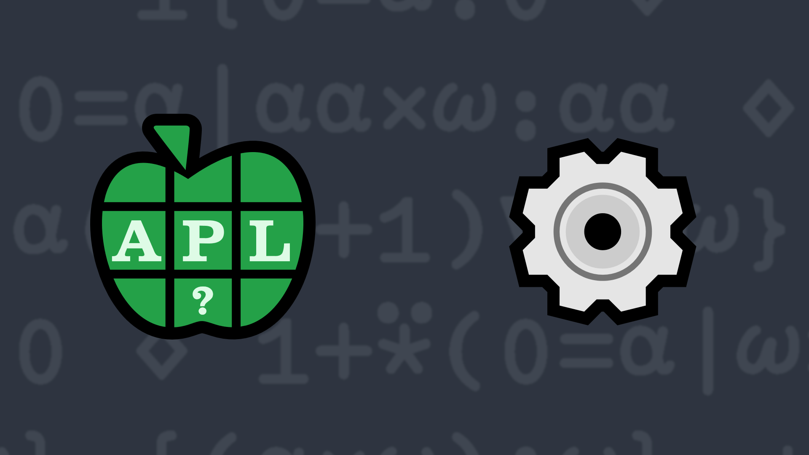

# <span class=s>2014-</span>7: Revolutionary Thinking

Imagine there are two circles that are tangent to one another. One circle is stationary, the other can "roll"
around the stationary circle.


<div align="center">

</div>


Write a dfn which takes the diameters of the stationary and mobile circles and returns the number of
revolutions the mobile must traverse until the tangent points meet again.

### Test cases

```APL
      10 (your_function) 10 ⍝ identically sized circles
1
      10 (your_function) 5 ⍝ a mobile circle that's half the size needs to make 2 revolutions
2
      5 (your_function) 7 ⍝ a mobile circle of diameter 7 needs to make 5 revolutions around a stationary circle of diameter 5
5
```
<div class="pdiv">
  <code onclick="p_Input.focus()">your_function ← </code><input id="p_Input" autocomplete="off" spellcheck="false" oninput="this.parentElement.querySelector`button`.disabled=false;localStorage.setItem(window.location.pathname,this.value)" onkeypress="subm(event)">
  <button onclick="alert$.next`Testing…`;submitSolution`p`" class="md-button md-button--primary">&#x2714; Test</button>
</div>
<blockquote id="p_Output"></blockquote>
## Solutions
<div onclick="play(this)" title="Video on YouTube" class="yt">

<time>15:56</time>

</div>
<a href="https://chat.stackexchange.com/transcript/52405?m=61231677#61231677" target="_blank" class="md-button md-button--primary">Chat transcript</a>
<a href="https://github.com/abrudz/apl_quest/blob/main/2014/7.apl" target="_blank" class="md-button md-button--primary right">Code on GitHub</a>

<script>
    testCases={"a":[["10","10"],["10","5"],["5","10"],["5","7"]],"b":[["0","1"],["?10","?10"],["15","18"],["10+?10","10+?10"]],"f":"{(⍺∧⍵)÷⍵}"}
    p_Input.value=localStorage.getItem(window.location.pathname)
    play=e=>e.outerHTML=`<iframe src="https://www.youtube.com/embed/aiEOXOy56iw?list=PLYKQVqyrAEj9wDIUyLDGtDAFTKY38BUMN&autoplay=1" title="<span class=s>2014-</span>7: Revolutionary Thinking (APL Quest 2014-7)" frameborder="0" allow="accelerometer; autoplay; clipboard-write; encrypted-media; gyroscope; picture-in-picture; web-share" referrerpolicy="strict-origin-when-cross-origin" allowfullscreen></iframe>`
</script>
