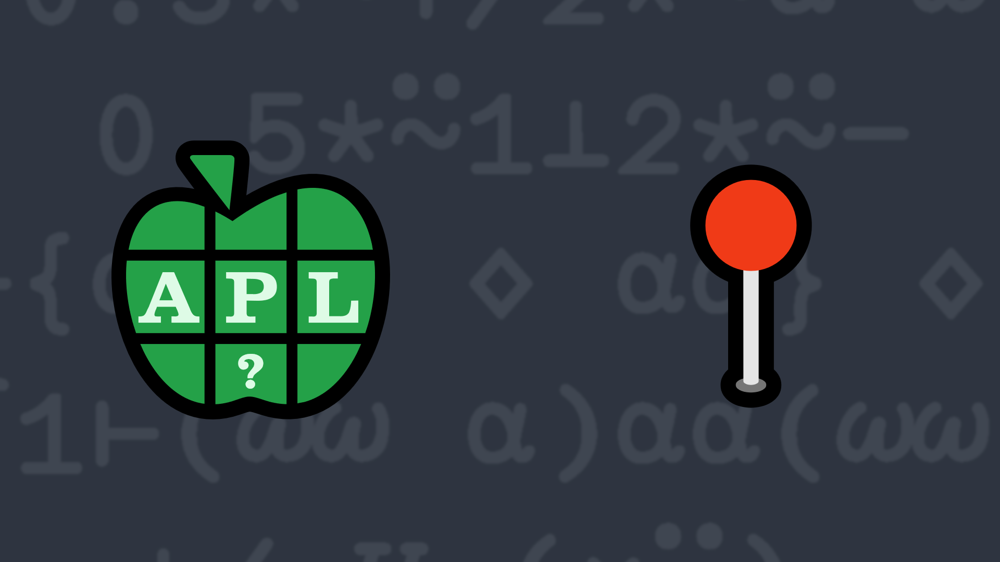

# <span class=s>2014-</span>8: Go The Distance

Write a dfn that returns the distance between two points in a space of any number of dimensions.

### Test cases

```APL
      2 (your_function) 5 ⍝ one-dimensional space
3
      2 2 (your_function) 5 6 ⍝ two-dimensional space
5
      ⍬ (your_function) ⍬ ⍝ zero dimension space
0
      2 2 3 4 (your_function) 3 7 10 9 ⍝ four-dimensions
10
```
<div class="pdiv">
  <code onclick="p_Input.focus()">your_function ← </code><input id="p_Input" autocomplete="off" spellcheck="false" oninput="this.parentElement.querySelector`button`.disabled=false;localStorage.setItem(window.location.pathname,this.value)" onkeypress="subm(event)">
  <button onclick="alert$.next`Testing…`;submitSolution`p`" class="md-button md-button--primary">&#x2714; Test</button>
</div>
<blockquote id="p_Output"></blockquote>
## Solutions
<div onclick="play(this)" title="Video on YouTube" class="yt">


</div>
<a href="https://chat.stackexchange.com/transcript/52405/2022/6/3" target="_blank" class="md-button md-button--primary">Chat transcript</a>
<a href="https://github.com/dyalog/apl.quest/blob/main/2014/8.apl" target="_blank" class="md-button md-button--primary right">Code on GitHub</a>

<script>
    testCases={"a":[["2","5"],["2 2","5 6"],["2 2 3 4","3 7 10 9"],["0 0","6 8"]],"b":[["0","0"],["⍬","⍬"],["?4⍴10","?4⍴10"],["-?5⍴10","?5⍴10"],["-?3⍴10","-?3⍴10"],["(-10)+?5⍴20","(-10)+?5⍴20"]],"f":"{(+/(⍺-⍵)*2)*0.5}"}
    p_Input.value=localStorage.getItem(window.location.pathname)
    play=e=>e.outerHTML=`<iframe src="https://www.youtube.com/embed/OEChBu1p98w?list=PLYKQVqyrAEj9wDIUyLDGtDAFTKY38BUMN&autoplay=1" title="<span class=s>2014-</span>8: Go The Distance (APL Quest 2014-8)" frameborder="0" allow="accelerometer; autoplay; clipboard-write; encrypted-media; gyroscope; picture-in-picture; web-share" referrerpolicy="strict-origin-when-cross-origin" allowfullscreen></iframe>`
</script>
