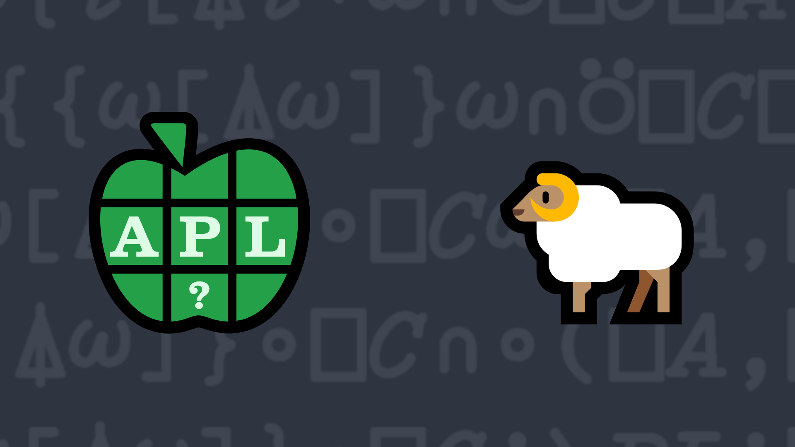

# <span class=s>2015-</span>1: Nag A Ram
Write a function that takes two character vectors as its left and right arguments and returns `1` if they are anagrams of each other. An anagram of a string uses all of the letters of the string ignoring word spacing, capitalisation, and punctuation.

### Examples:

```APL
      'anagram' (your_function) 'Nag A Ram' 
1
      'Dyalog APL' (your_function) 'Dog Pay All' 
1
      '' (your_function) '  !#!' 
1
      'abcde' (your_function) 'zyxwvu'
0
```


                               
<div class="pdiv">
  <code onclick="p_Input.focus()">your_function ← </code><input id="p_Input" autocomplete="off" spellcheck="false" oninput="this.parentElement.querySelector`button`.disabled=false;localStorage.setItem(window.location.pathname,this.value)" onkeypress="subm(event)">
  <button onclick="alert$.next`Testing…`;submitSolution`p`" class="md-button md-button--primary">&#x2714; Test</button>
</div>
<p id="p_Output"></p>
## Solutions
<div onclick="play(this)" title="Video on YouTube" class="yt">

<time>16:22</time>

</div>
<a href="https://chat.stackexchange.com/transcript/52405?m=61439442#61439442" target="_blank" class="md-button md-button--primary">Chat transcript</a>
<a href="https://github.com/abrudz/apl_quest/tree/main/2015/1.apl" target="_blank" class="md-button md-button--primary right">Code on GitHub</a>

<script>
    testCases={"a":[["'anagram'","'Nag A Ram'"],["'Dyalog APL'","'Dog Pay All'"],["'abcde'","'zyxwvu'"],["⌽⎕A","⎕A"]],"b":[["'*^%&'","' !#!'"],["''","''"],["'ALBERT EINSTEIN'","'TEN ELITE BRAINS'"],["⎕A[?50⍴26]","⎕A[?50⍴26]"]],"f":"{(1⎕C⍺){⍺[⍸⍺∊⎕A]{26=+/(+⌿⍉(⍉⍺∘.=⎕A),26 1⍴0)=+⌿⍉(⍉⍵∘.=⎕A),26 1⍴0}⍵[⍸⍵∊⎕A]}1⎕C⍵}"}
    p_Input.value=localStorage.getItem(window.location.pathname)
    play=e=>e.outerHTML=`<iframe src="https://www.youtube.com/embed/nmUQ9cSQajY?list=PLYKQVqyrAEj9wDIUyLDGtDAFTKY38BUMN&autoplay=1" title="<span class=s>2015-</span>1: Nag A Ram (APL Quest 2015-1)" frameborder="0" allow="accelerometer; autoplay; clipboard-write; encrypted-media; gyroscope; picture-in-picture; web-share" referrerpolicy="strict-origin-when-cross-origin" allowfullscreen></iframe>`
</script>
