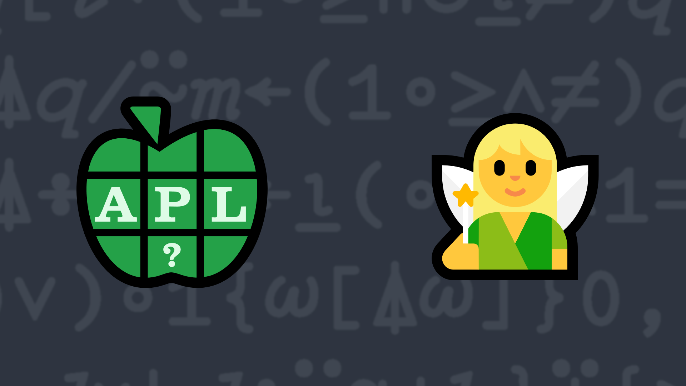

# 3: Farey Tale

### Examples:
In mathematics, the [Farey_sequence](https://en.wikipedia.org/wiki/Farey_sequence) of order n is the sequence of completely reduced fractions between 0 and 1 which, when in lowest terms, have denominators less than or equal to n, arranged in order of increasing size. Each Farey sequence starts with the value 0, denoted by the fraction 0⁄1, and ends with the value 1, denoted by the fraction 1⁄1.

Write a function that takes an integer right argument and returns a vector of the terms in the Farey sequence of that order. Each element in the returned vector is itself a 2-element vector of numerator and denominator for the corresponding term.


```APL
      your_function 0 
┌───┐
│0 1│
└───┘
      your_function 1
┌───┬───┐
│0 1│1 1│
└───┴───┘
      your_function 5
┌───┬───┬───┬───┬───┬───┬───┬───┬───┬───┬───┐
│0 1│1 5│1 4│1 3│2 5│1 2│3 5│2 3│3 4│4 5│1 1│
└───┴───┴───┴───┴───┴───┴───┴───┴───┴───┴───┘
```


                              
<div class="pdiv">
  <code>your_function ← </code><input id="p_Input" autocomplete="off" spellcheck="false">
  <button onclick="alert$.next`Testing…`;submitSolution`p`" class="md-button">&#x2714; Test</button>
</div>
<blockquote id="p_Output"></blockquote>
??? info "Solutions"
    <div onclick="play(this)">
        
        
    </div>

    [Chat transcript](https://chat.stackexchange.com/transcript/52405?m=61541307#61541307)&emsp;∙&emsp;[Code on GitHub](https://github.com/abrudz/apl_quest/blob/main/2015/2.apl)
<script>
    testCases={"a":["5","3","1","2","6","7","10"],"b":["0","?10","?20","10+?20"],"f":"{↓⍉↑{1∧(0(⍵=0)+⊂⍵)*1 ¯1} {{0,⍵[⍋⍵]}⍵[⍸1≥⍵]}∪÷/¨,⍳⍵ ⍵}"}
    play=e=>e.outerHTML=`<iframe src="https://www.youtube.com/embed/7bLqOYg5DZk" title="3: Farey Tale (APL Quest 2015-3)" frameborder="0" allow="accelerometer; autoplay; clipboard-write; encrypted-media; gyroscope; picture-in-picture; web-share" referrerpolicy="strict-origin-when-cross-origin" allowfullscreen></iframe>`
    p_Input.focus()
</script>
