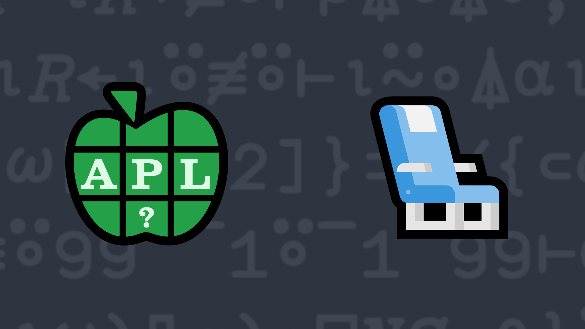

# <span class=s>2015-</span>4: PDI - Progressive Dyadic Iota
The index-of function `X⍳Y` returns a simple integer vector that identifies where the [major cells](https://aplwiki.com/wiki/Major_cell) of `Y` are first found in `X`. If a major cell of `Y` cannot be found in `X`, then the corresponding item of the returned array will be `1+≢X`.

Example of `X⍳Y`:  
```APL
      'DYALOG APL' ⍳ 'AAALLLB' 
3 3 3 4 4 4 11
```

*Progressive dyadic iota* is similar to `⍳` except that it returns the index of subsequent matches in the left argument until they are exhausted. Write a function that implements progressive dyadic iota.

### Examples:

```APL
      'DYALOG APL' (your_function) 'AAALLLB' 
3 8 11 4 10 11 11
      '' (your_function) 'test'  ⍝ should work with empty left argument 
1 1 1 1 
      ⍬≡'test' (your_function) ''  ⍝ should work with empty right argument
1
```


              
<div class="pdiv">
  <code onclick="p_Input.focus()">your_function ← </code><input id="p_Input" autocomplete="off" spellcheck="false" oninput="this.parentElement.querySelector`button`.disabled=false;localStorage.setItem(window.location.pathname,this.value)" onkeypress="subm(event)">
  <button onclick="alert$.next`Testing…`;submitSolution`p`" class="md-button md-button--primary">&#x2714; Test</button>
</div>
<p id="p_Output"></p>
## Solutions
<div onclick="play(this)" title="Video on YouTube" class="yt">

<time>35:10</time>

</div>
<a href="https://chat.stackexchange.com/transcript/52405?m=61590333#61590333" target="_blank" class="md-button md-button--primary">Chat transcript</a>
<a href="https://github.com/abrudz/apl_quest/blob/main/2015/4.apl" target="_blank" class="md-button md-button--primary right">Code on GitHub</a>

<script>
    testCases={"a":[["'DYALOG APL'","'AAALLLB'"],["''","'TEST'"],["'TEST'","''"],["'DYALOG APL'","'DYALOG APL'"]],"b":[["⎕A[?20⍴26]","⎕A[?20⍴26]"],["⎕A[?(10+?20)⍴26]","⎕A[?(10+?20)⍴26]"],["(⎕A,' ')[?(30+?50)⍴27]","(⎕A,' ')[?(30+?50)⍴27]"]],"f":"{((⍴⍺)⍴⍋⍋⍺⍳⍺,⍵)⍳(⍴⍵)⍴⍋⍋⍺⍳⍵,⍺}"}
    p_Input.value=localStorage.getItem(window.location.pathname)
    play=e=>e.outerHTML=`<iframe src="https://www.youtube.com/embed/FGzpsUK5WF4?list=PLYKQVqyrAEj9wDIUyLDGtDAFTKY38BUMN&autoplay=1" title="<span class=s>2015-</span>4: PDI - Progressive Dyadic Iota (APL Quest 2015-4)" frameborder="0" allow="accelerometer; autoplay; clipboard-write; encrypted-media; gyroscope; picture-in-picture; web-share" referrerpolicy="strict-origin-when-cross-origin" allowfullscreen></iframe>`
</script>
