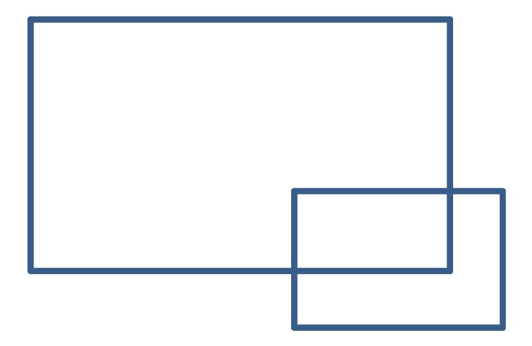
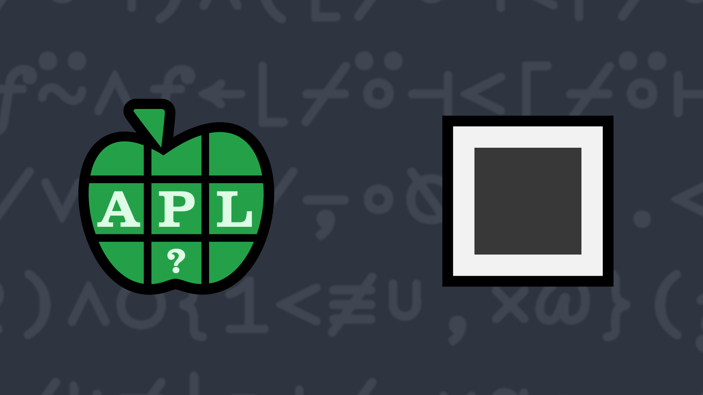

# <span class=s>2015-</span>6: Hey! This is My Space
Write a function that takes, as each of its right and left arguments, a pair of co-ordinates representing diagonally opposite corners of two rectangles and returns a `1` if the rectangles overlap. The co-ordinates could be either (upper-left, lower-right) or (upper-right, lower left).

<div align="center">

</div>

### Examples:

```APL
      (1 1)(5 5) (your_function) (3 3)(7 7)
1
      (1 1)(5 5) (your_function) (5 5)(1 1)
1
      (1 1)(3 3) (your_function) (4 4)(7 7)
0
      (1.1 1.1)(5.5 5.5) (your_function) (3.3 3.3)(4.4 4.4)
1 
```


                    
<div class="pdiv">
  <code onclick="p_Input.focus()">your_function ← </code><input id="p_Input" autocomplete="off" spellcheck="false" oninput="this.parentElement.querySelector`button`.disabled=false;localStorage.setItem(window.location.pathname,this.value)" onkeypress="subm(event)">
  <button onclick="alert$.next`Testing…`;submitSolution`p`" class="md-button md-button--primary">&#x2714; Test</button>
</div>
<blockquote id="p_Output"></blockquote>
## Solutions
<div onclick="play(this)" title="Video on YouTube" class="yt">


</div>
<a href="https://chat.stackexchange.com/transcript/message/61688071#61688071" target="_blank" class="md-button md-button--primary">Chat transcript</a>
<a href="https://github.com/abrudz/apl_quest/blob/main/2015/6.apl" target="_blank" class="md-button md-button--primary right">Code on GitHub</a>

<script>
    testCases={"a":[["(1 1)(5 5)","(3 3)(7 7)"],["(1 1)(5 5)","(3 3)(7 7)"],["(1 1)(5 5)","(5 5)(1 1)"],["(1 1)(3 3)","(4 4)(7 7)"],["(0 0)(1 5)","(¯1 2)(2 3)"],["(1.1 1.1)(5.5 5.5)","(3.3 3.3)(4.4 4.4)"]],"b":[["(?10 10)(?10 10)","(?10 10)(?10 10)"],["(-?10 10)(-?10 10)","(-?10 10)(-?10 10)"],["((-10)+?20 20)((-10)+?20 20)","((-10)+?20 20)((-10)+?20 20)"]],"f":"{∧/∨⌿↑≠/⍪∘⍉⍨⍺∘.<⍵}"}
    p_Input.value=localStorage.getItem(window.location.pathname)
    play=e=>e.outerHTML=`<iframe src="https://www.youtube.com/embed/Ya832W9iBC4?list=PLYKQVqyrAEj9wDIUyLDGtDAFTKY38BUMN&autoplay=1" title="<span class=s>2015-</span>6: Hey! This is My Space (APL Quest 2015-6)" frameborder="0" allow="accelerometer; autoplay; clipboard-write; encrypted-media; gyroscope; picture-in-picture; web-share" referrerpolicy="strict-origin-when-cross-origin" allowfullscreen></iframe>`
</script>
