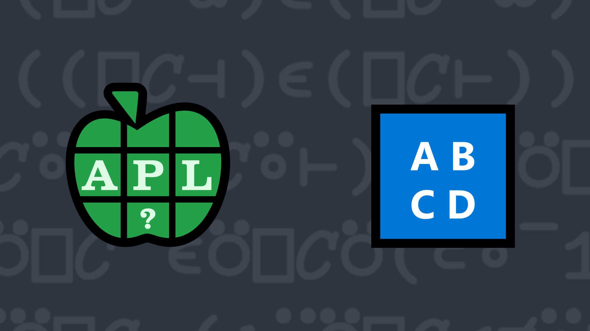

# <span class=s>2015-</span>7: Just in (Upper) Case
Membership `X∊Y` returns a boolean array of shape `⍴X` with `1`s indicating where elements of `Y` occur in `X`. For a vector `X` this results in a very convenient boolean mask.

In many instances, it is desirable to perform case-insensitive comparisons and operations. Write a function to perform case-insensitive membership between two arrays.

For full marks, consider membership of [cells](https://aplwiki.com/wiki/Cell) in high-rank arrays, your function should still return a vector when comparing cells of the same rank, for example (`3 2⍴⎕A`) and (`1 2⍴'cd'`).

### Examples:

```APL
      'dyalog' (your_function) 'APL'
0 0 1 1 0 0
      'bramley' (your_function) 'HAMPSHIRE'
0 1 1 1 0 1 0
```


                      
<div class="pdiv">
  <code onclick="p_Input.focus()">your_function ← </code><input id="p_Input" autocomplete="off" spellcheck="false" oninput="this.parentElement.querySelector`button`.disabled=false;localStorage.setItem(window.location.pathname,this.value)" onkeypress="subm(event)">
  <button onclick="alert$.next`Testing…`;submitSolution`p`" class="md-button md-button--primary">&#x2714; Test</button>
</div>
<blockquote id="p_Output"></blockquote>
## Solutions
<div onclick="play(this)" title="Video on YouTube" class="yt">

<time>5:50</time>

</div>
<a href="https://chat.stackexchange.com/transcript/52405?m=61731271#61731271" target="_blank" class="md-button md-button--primary">Chat transcript</a>
<a href="https://github.com/abrudz/apl_quest/blob/main/2015/7.apl" target="_blank" class="md-button md-button--primary right">Code on GitHub</a>

<script>
    testCases={"a":[["'dyalog'","'APL'"],["'transcend'","'INCANDESCENT'"]],"b":[["{⍵⌷⍨⊂?⍨≢⍵}5 2⍴⎕A","⍉⍪'CD'"],["↑'Amy' 'Pete' 'Leslie'","⍉⍪'LESLIE'"]],"f":"{⊃{(≢⍵)≥⍵⍳⍺}/1 ⎕C ⍺ ⍵}"}
    p_Input.value=localStorage.getItem(window.location.pathname)
    play=e=>e.outerHTML=`<iframe src="https://www.youtube.com/embed/syzyAQc11M8?list=PLYKQVqyrAEj9wDIUyLDGtDAFTKY38BUMN&autoplay=1" title="<span class=s>2015-</span>7: Just in (Upper) Case (APL Quest 2015-7)" frameborder="0" allow="accelerometer; autoplay; clipboard-write; encrypted-media; gyroscope; picture-in-picture; web-share" referrerpolicy="strict-origin-when-cross-origin" allowfullscreen></iframe>`
</script>
