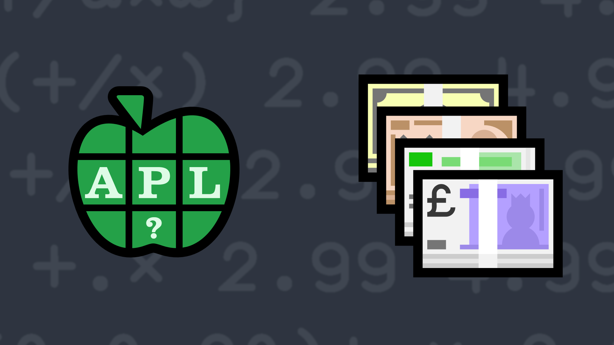

# <span class=s>2016-</span>10: Order Total 

Suppose you have a numeric vector that is the list of prices for a set of retail products. You also have a numeric vector that is the number ordered of each product. Write a function that takes as its right argument a vector of prices and as its left argument a numeric vector that indicates the number ordered and returns the total cost for the order. In case you hadn't realized it, this is an application the dot product. The dot product of two vectors <span class="math"><i>A</i> = [<i>A</i><sub>1</sub>, <i>A</i><sub>2</sub>, …,<i>A</i><sub>n</sub>]</span> and <span class="math"><i>B</i> = [<i>B</i><sub>1</sub>, <i>B</i><sub>2</sub>, …,<i>B</i><sub>n</sub>]</span> is defined as

<p style="overflow-x: auto;">
  
</p>

### Examples:

```APL
      5 0 2 (your_function) 2.99 4.99 1.99
18.93
      0 0 0 (your_function) 2.99 4.99 1.99
0 
```
<div class="pdiv">
  <code onclick="p_Input.focus()">your_function ← </code><input id="p_Input" autocomplete="off" spellcheck="false" oninput="this.parentElement.querySelector`button`.disabled=false;localStorage.setItem(window.location.pathname,this.value)" onkeypress="subm(event)">
  <button onclick="alert$.next`Testing…`;submitSolution`p`" class="md-button md-button--primary">&#x2714; Test</button>
</div>
<blockquote id="p_Output"></blockquote>
## Solutions
<div onclick="play(this)" title="Video on YouTube" class="yt">


</div>
<a href="https://chat.stackexchange.com/transcript/52405?m=62313927#62313927" target="_blank" class="md-button md-button--primary">Chat transcript</a>
<a href="https://github.com/abrudz/apl_quest/tree/main/2016/10.apl" target="_blank" class="md-button md-button--primary right">Code on GitHub</a>

<script>
    testCases={"a":[["5 0 2","2.99 4.99 1.99"],["0 0 0","2.99 4.99 1.99"],["1 2 3 4 5","5 4 3 2 1"],["?5⍴10","?5⍴10"],["0.1×?20⍴100","0.1×?20⍴100"]],"b":[["⍬","⍬"],["?20⍴100","0.1×?20⍴100"],["(-1)+?20⍴?10","0.1×?20⍴100"],["(-10)+?20⍴?20","0.1×?20⍴100"],["(-10)+?20⍴?20","(-10)+?20⍴?20"]],"f":"{+/⍺×⍵}"}
    p_Input.value=localStorage.getItem(window.location.pathname)
    play=e=>e.outerHTML=`<iframe src="https://www.youtube.com/embed/5rfCeT_lPk8?list=PLYKQVqyrAEj9wDIUyLDGtDAFTKY38BUMN&autoplay=1" title="<span class=s>2016-</span>10: Order Total  (APL Quest 2016-10)" frameborder="0" allow="accelerometer; autoplay; clipboard-write; encrypted-media; gyroscope; picture-in-picture; web-share" referrerpolicy="strict-origin-when-cross-origin" allowfullscreen></iframe>`
</script>
