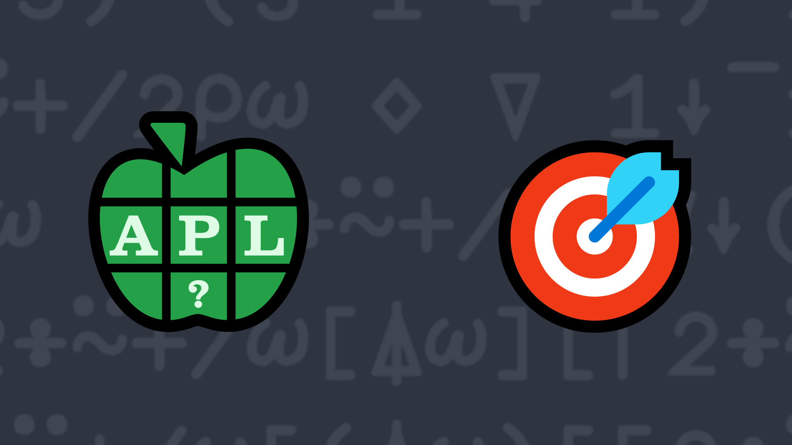

# <span class=s>2016-</span>2: Statistics - Median
Write a function that takes a numeric vector as its right argument and returns the median of the array. The median is the number separating the higher half of the vector from the lower half. The median can be found by arranging all the observations from lowest value to highest value and picking the middle one. If there is an even number of observations, then there is no single middle value; the median is then defined to be the mean of the two middle values.

### Examples:

```APL
     (your_function) 1 2 3 4 5 6 7 8 9 
5
     (your_function) 1 8 2 7 3 6 4 5
4.5
     (your_function) ⍬
0
     (your_function) ,7 
7
```
<div class="pdiv">
  <code onclick="p_Input.focus()">your_function ← </code><input id="p_Input" autocomplete="off" spellcheck="false" oninput="this.parentElement.querySelector`button`.disabled=false;localStorage.setItem(window.location.pathname,this.value)" onkeypress="subm(event)">
  <button onclick="alert$.next`Testing…`;submitSolution`p`" class="md-button md-button--primary">&#x2714; Test</button>
</div>
<p id="p_Output"></p>
## Solutions
<div onclick="if(event.target.tagName!='A'){play(this)}" title="Video on YouTube" class="yt">

<div>Click to load video from YouTube. This will enable YouTube tracking. <a href="https://support.google.com/youtube/answer/10364219" target="_blank" rel="noopener">YouTube Privacy Information</a></div>
<time>23:22</time>

</div>
<a href="https://chat.stackexchange.com/transcript/52405?m=61968437#61968437" target="_blank" class="md-button md-button--primary">Chat transcript</a>
<a href="https://github.com/abrudz/apl_quest/tree/main/2016/2.apl" target="_blank" class="md-button md-button--primary right">Code on GitHub</a>

<script>
    testCases={"a":["1 2 3 4 5 6 7 8 9","1 8 2 7 3 6 4 5","6 2 7 0 5 3 7 8 7 0","7","0"],"b":["?10 10 10 10","⍬","?10⍴10","?(?20)⍴?20","?(?30)⍴10"],"f":"{(0,(,⍵)[⍋,⍵],0){0.5×⍺[⌈⍵]+⍺[⌊⍵]}0.5×1+≢⍵,0 0}"}
    p_Input.value=localStorage.getItem(window.location.pathname)
    play=e=>e.outerHTML=`<iframe class="md-header--shadow" src="https://www.youtube.com/embed/oBkCJfi_OEU?list=PLYKQVqyrAEj9wDIUyLDGtDAFTKY38BUMN&autoplay=1" title="<span class=s>2016-</span>2: Statistics - Median (APL Quest 2016-2)" frameborder="0" allow="accelerometer; autoplay; clipboard-write; encrypted-media; gyroscope; picture-in-picture; web-share" referrerpolicy="strict-origin-when-cross-origin" allowfullscreen></iframe>`
</script>
