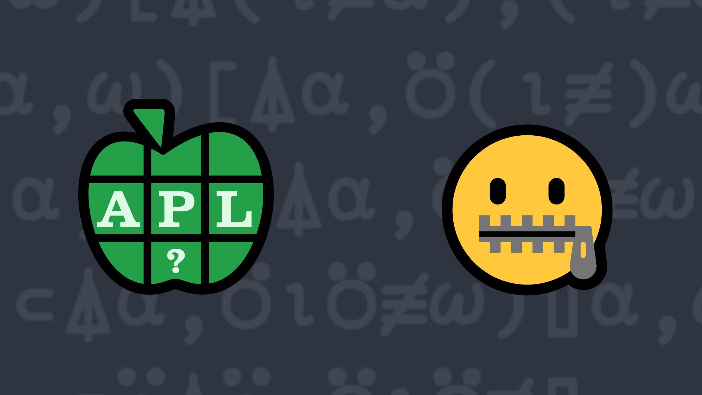

# <span class=s>2016-</span>4: Just Meshing Around
Write a function that takes vectors as its left and right arguments and returns them “meshed” into a single vector formed by alternately taking successive elements from each argument. The arguments do not have to be the same length. 

### Examples:

```APL
      'MENS' (your_function) 'EKES' 
MEEKNESS
      'Dyalog' (your_function) 'APL'   
DAyPaLlog
      'APL' (your_function) 'Dyalog' 
ADPyLalog
       1 3 5 7 (your_function) 2 4 6 8   ⍝ should work with numeric vectors 
1 2 3 4 5 6 7 8
       '' (your_function) 'Hello'  ⍝ either or both arguments could be empty
Hello
```
<div class="pdiv">
  <code onclick="p_Input.focus()">your_function ← </code><input id="p_Input" autocomplete="off" spellcheck="false" oninput="this.parentElement.querySelector`button`.disabled=false;localStorage.setItem(window.location.pathname,this.value)" onkeypress="subm(event)">
  <button onclick="alert$.next`Testing…`;submitSolution`p`" class="md-button md-button--primary">&#x2714; Test</button>
</div>
<blockquote id="p_Output"></blockquote>
## Solutions
<div onclick="play(this)" title="Video on YouTube" class="yt">

<time>12:07</time>

</div>
<a href="https://chat.stackexchange.com/transcript/52405?m=62063400#62063400" target="_blank" class="md-button md-button--primary">Chat transcript</a>
<a href="https://github.com/abrudz/apl_quest/tree/main/2016/4.apl" target="_blank" class="md-button md-button--primary right">Code on GitHub</a>

<script>
    testCases={"a":[["'MENS'","'EKES'"],["'APL'","'Dyalog'"],["'Dyalog'","'APL'"],["1 3 5 7","2 4 6 8"],["⎕A[?10⍴26]","⎕A[?10⍴26]"]],"b":[["'Hello'","''"],["''","'Hello'"],["''","''"],["⎕A[?(?20)⍴26]","⎕A[?(?20)⍴26]"],["?(?20)⍴26","?(?20)⍴26"],["?(?20)⍴26","⎕A[?(?20)⍴26]"]],"f":"{((↓⍺),(↓⍵))[⍒(≢⍺),(≢⍵)]{(,↑⍵[⍳≢↑⍺[2]]),(↑⍺[1])[(≢↑⍺[2])+⍳(≢↑⍺[1])-(≢↑⍺[2])]}(⍵,⍺),¨⍨(⍺,⍵)}"}
    p_Input.value=localStorage.getItem(window.location.pathname)
    play=e=>e.outerHTML=`<iframe src="https://www.youtube.com/embed/59eKagcVoO4?list=PLYKQVqyrAEj9wDIUyLDGtDAFTKY38BUMN&autoplay=1" title="<span class=s>2016-</span>4: Just Meshing Around (APL Quest 2016-4)" frameborder="0" allow="accelerometer; autoplay; clipboard-write; encrypted-media; gyroscope; picture-in-picture; web-share" referrerpolicy="strict-origin-when-cross-origin" allowfullscreen></iframe>`
</script>
