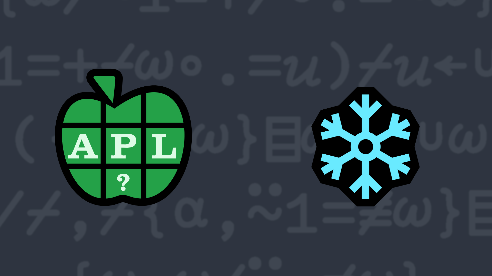

# <span class=s>2016-</span>5: You're Unique, Just Like Everyone Else
Write a function that takes a vector as its right argument and returns elements that occur only once in the vector.

### Examples:

```APL
     (your_function) 1 2 3 4 5
1 2 3 4 5
     (your_function) 1 2 3 4 5 4 3 2 1 
5
     (your_function) 'hello world' 
he wrd
```
<div class="pdiv">
  <code onclick="p_Input.focus()">your_function ← </code><input id="p_Input" autocomplete="off" spellcheck="false" oninput="this.parentElement.querySelector`button`.disabled=false;localStorage.setItem(window.location.pathname,this.value)" onkeypress="subm(event)">
  <button onclick="alert$.next`Testing…`;submitSolution`p`" class="md-button md-button--primary">&#x2714; Test</button>
</div>
<blockquote id="p_Output"></blockquote>
## Solutions
<div onclick="play(this)" title="Video on YouTube" class="yt">


</div>
<a href="https://chat.stackexchange.com/transcript/52405?m=62107645#62107645" target="_blank" class="md-button md-button--primary">Chat transcript</a>
<a href="https://github.com/abrudz/apl_quest/tree/main/2016/5.apl" target="_blank" class="md-button md-button--primary right">Code on GitHub</a>

<script>
    testCases={"a":["1 2 3 4 5","1 2 3 4 5 4 3 2 1","'hello world'","10⍴8","⎕A[10⍴17]","?10⍴10","⎕A[?10⍴26]"],"b":["⍬","?(?20)⍴20","?(5+?20)⍴10+?10","⎕A[?(?30)⍴26]","⎕A[?(5+?20)⍴10+?16]"],"f":"{⍵[⍸1=+/⍵∘.=⍵]}"}
    p_Input.value=localStorage.getItem(window.location.pathname)
    play=e=>e.outerHTML=`<iframe src="https://www.youtube.com/embed/zFSFcIskU4U?list=PLYKQVqyrAEj9wDIUyLDGtDAFTKY38BUMN&autoplay=1" title="<span class=s>2016-</span>5: You're Unique, Just Like Everyone Else (APL Quest 2016-5)" frameborder="0" allow="accelerometer; autoplay; clipboard-write; encrypted-media; gyroscope; picture-in-picture; web-share" referrerpolicy="strict-origin-when-cross-origin" allowfullscreen></iframe>`
</script>
