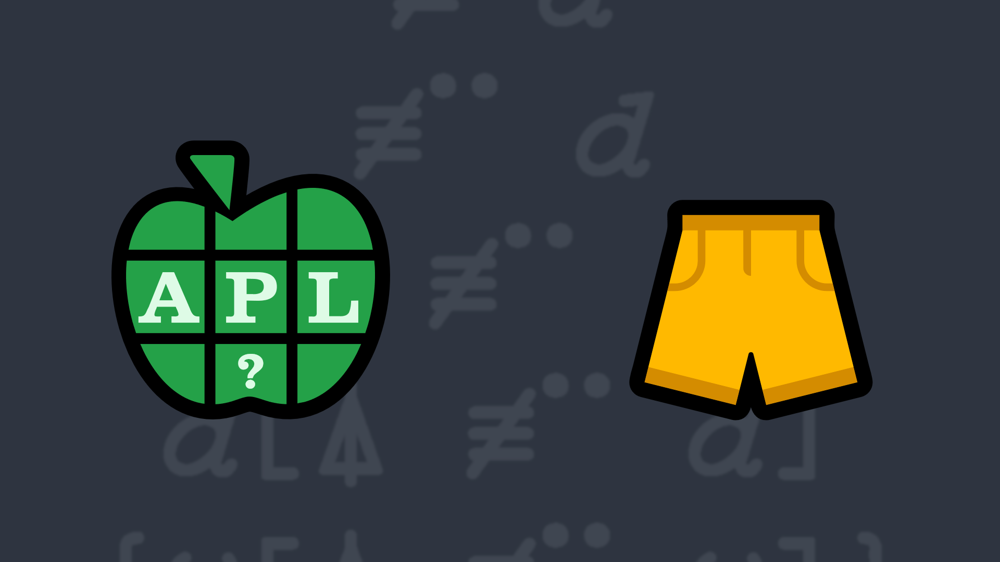

# <span class=s>2016-</span>6: Shorter Ones to the Front
Write a function that takes a vector of vectors as its right argument and returns it sorted by the length of each element. An element of the vector can be scalar or an empty vector. 

### Examples:

```APL
     (your_function) 'one' 'two' 'three' 'four' 'five' 'six'
┌───┬───┬───┬────┬────┬─────┐
│one│two│six│four│five│three│
└───┴───┴───┴────┴────┴─────┘
     (your_function) (2 4 3) (4 5) 1 (7 3)
┌─┬───┬───┬─────┐
│1│4 5│7 3│2 4 3│
└─┴───┴───┴─────┘
     (your_function) ⍬   ⍝ should return an empty vector      

     (your_function) 'one' 2 'three' '' 'four' (5 6 7 8)
┌┬─┬───┬────┬───────┬─────┐
││2│one│four│5 6 7 8│three│
└┴─┴───┴────┴───────┴─────┘
```
<div class="pdiv">
  <code onclick="p_Input.focus()">your_function ← </code><input id="p_Input" autocomplete="off" spellcheck="false" oninput="this.parentElement.querySelector`button`.disabled=false;localStorage.setItem(window.location.pathname,this.value)" onkeypress="subm(event)">
  <button onclick="alert$.next`Testing…`;submitSolution`p`" class="md-button md-button--primary">&#x2714; Test</button>
</div>
<p id="p_Output"></p>
## Solutions
<div onclick="play(this)" title="Video on YouTube" class="yt">

<time>4:19</time>

</div>
<a href="https://chat.stackexchange.com/transcript/52405?m=62151647#62151647" target="_blank" class="md-button md-button--primary">Chat transcript</a>
<a href="https://github.com/abrudz/apl_quest/tree/main/2016/6.apl" target="_blank" class="md-button md-button--primary right">Code on GitHub</a>

<script>
    testCases={"a":["(2 4 3) (4 5) 1 (7 3)","'one' 'two' 'three' 'four' 'five' 'six'","'one' 2 'three' '' 'four' (5 6 7 8)","(?5⍴5)⍴¨1","⍬"],"b":["(?(?10)⍴5)⍴¨1","(?(?10)⍴(5+?10))⍴¨?10","(?(?10)⍴(5+?10))⍴¨⎕A[?26]"],"f":"{⍵[⍋≢¨⍵]}"}
    p_Input.value=localStorage.getItem(window.location.pathname)
    play=e=>e.outerHTML=`<iframe class="md-header--shadow" src="https://www.youtube.com/embed/ZmVuGl6-DJk?list=PLYKQVqyrAEj9wDIUyLDGtDAFTKY38BUMN&autoplay=1" title="<span class=s>2016-</span>6: Shorter Ones to the Front (APL Quest 2016-6)" frameborder="0" allow="accelerometer; autoplay; clipboard-write; encrypted-media; gyroscope; picture-in-picture; web-share" referrerpolicy="strict-origin-when-cross-origin" allowfullscreen></iframe>`
</script>
