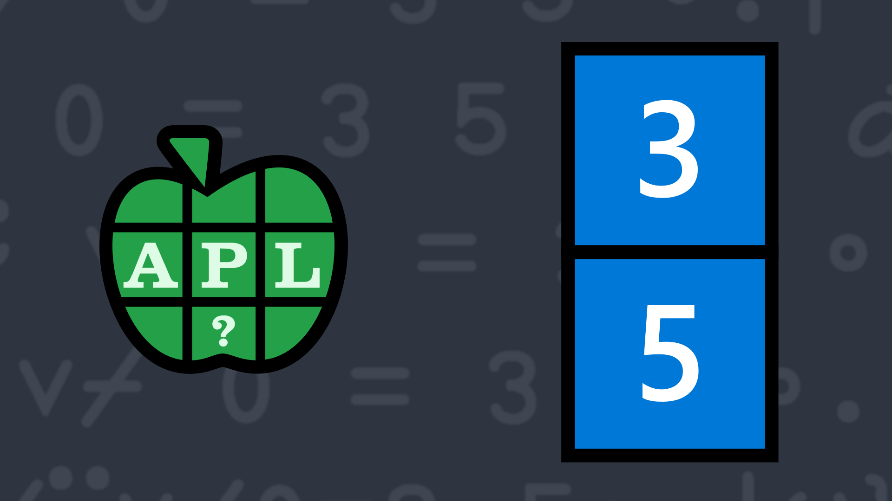

# <span class=s>2016-</span>7: 3s and 5s
Write a function that takes a numeric vector and returns all elements that are divisible by 3 or 5.

### Examples:

```APL
     (your_function) 1 2 3 4 5 6 7 8 9 10
3 5 6 9 10
     (your_function) ⍬   ⍝ should return an empty vector

```
<div class="pdiv">
  <code onclick="p_Input.focus()">your_function ← </code><input id="p_Input" autocomplete="off" spellcheck="false" oninput="this.parentElement.querySelector`button`.disabled=false;localStorage.setItem(window.location.pathname,this.value)" onkeypress="subm(event)">
  <button onclick="alert$.next`Testing…`;submitSolution`p`" class="md-button md-button--primary">&#x2714; Test</button>
</div>
<blockquote id="p_Output"></blockquote>
## Solutions
<div onclick="play(this)" title="Video on YouTube" class="yt">


</div>
<a href="https://chat.stackexchange.com/transcript/52405?m=62198343#62198343" target="_blank" class="md-button md-button--primary">Chat transcript</a>
<a href="https://github.com/abrudz/apl_quest/tree/main/2016/7.apl" target="_blank" class="md-button md-button--primary right">Code on GitHub</a>

<script>
    testCases={"a":["4 5 7 7 9 9 11","1 2 3 4 5 6 7 8 9 10","?10⍴10","5⍴6","5⍴7","?(?10)⍴10"],"b":["6","7","⍬","0","3×?(?10)⍴10","?(5+?20)⍴10+?10","0.5×?(10+?30)⍴10+?10"],"f":"{⍵[⍸(0=3|⍵)∨(0=5|⍵)]}"}
    p_Input.value=localStorage.getItem(window.location.pathname)
    play=e=>e.outerHTML=`<iframe src="https://www.youtube.com/embed/s1qIJ1LRfaQ?list=PLYKQVqyrAEj9wDIUyLDGtDAFTKY38BUMN&autoplay=1" title="<span class=s>2016-</span>7: 3s and 5s (APL Quest 2016-7)" frameborder="0" allow="accelerometer; autoplay; clipboard-write; encrypted-media; gyroscope; picture-in-picture; web-share" referrerpolicy="strict-origin-when-cross-origin" allowfullscreen></iframe>`
</script>
