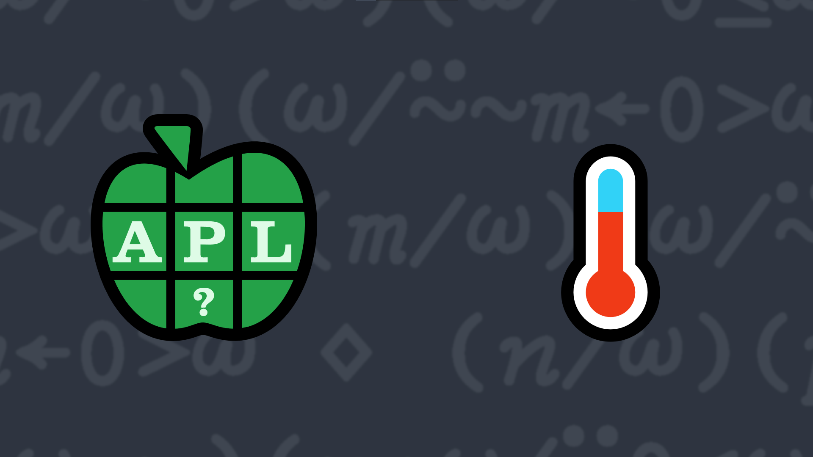

# <span class=s>2016-</span>8: Separating Out the Negative
Write a function that takes a numeric vector and returns a two element vector whose first element contains the values less than 0 (zero) in the vector and the second element contains all values greater than or equal to 0. 

### Examples:

```APL
     (your_function) 0 1 ¯2 3 ¯4 ¯5 6 7 8 ¯9 10 
┌───────────┬──────────────┐
│¯2 ¯4 ¯5 ¯9│0 1 3 6 7 8 10│
└───────────┴──────────────┘
     (your_function) 1 2 3 4 5
┌┬─────────┐
││1 2 3 4 5│
└┴─────────┘
     (your_function) ⍬   ⍝ should return a vector of two empty vectors 
┌┬┐
│││
└┴┘
```
<div class="pdiv">
  <code onclick="p_Input.focus()">your_function ← </code><input id="p_Input" autocomplete="off" spellcheck="false" oninput="this.parentElement.querySelector`button`.disabled=false;localStorage.setItem(window.location.pathname,this.value)" onkeypress="subm(event)">
  <button onclick="alert$.next`Testing…`;submitSolution`p`" class="md-button md-button--primary">&#x2714; Test</button>
</div>
<blockquote id="p_Output"></blockquote>
## Solutions
<div onclick="play(this)" title="Video on YouTube" class="yt">


</div>
<a href="https://chat.stackexchange.com/transcript/52405?m=62233525#62233525" target="_blank" class="md-button md-button--primary">Chat transcript</a>
<a href="https://github.com/dyalog/apl.quest/tree/main/2016/8.apl" target="_blank" class="md-button md-button--primary right">Code on GitHub</a>

<script>
    testCases={"a":["1 2 3 4 5","0 1 ¯2 3 ¯4 ¯5 6 7 8 ¯9 10","1","¯1","(?10⍴10)-5"],"b":["⍬","(?(?10)⍴10)-5","(?(5+?10)⍴10+?10)-10"],"f":"{(⍵/⍨0>⍵)(⍵/⍨0≤⍵)}","p":"{⍵[⍋⍵]}¨"}
    p_Input.value=localStorage.getItem(window.location.pathname)
    play=e=>e.outerHTML=`<iframe src="https://www.youtube.com/embed/ZSEJkNrEdOQ?list=PLYKQVqyrAEj9wDIUyLDGtDAFTKY38BUMN&autoplay=1" title="<span class=s>2016-</span>8: Separating Out the Negative (APL Quest 2016-8)" frameborder="0" allow="accelerometer; autoplay; clipboard-write; encrypted-media; gyroscope; picture-in-picture; web-share" referrerpolicy="strict-origin-when-cross-origin" allowfullscreen></iframe>`
</script>
