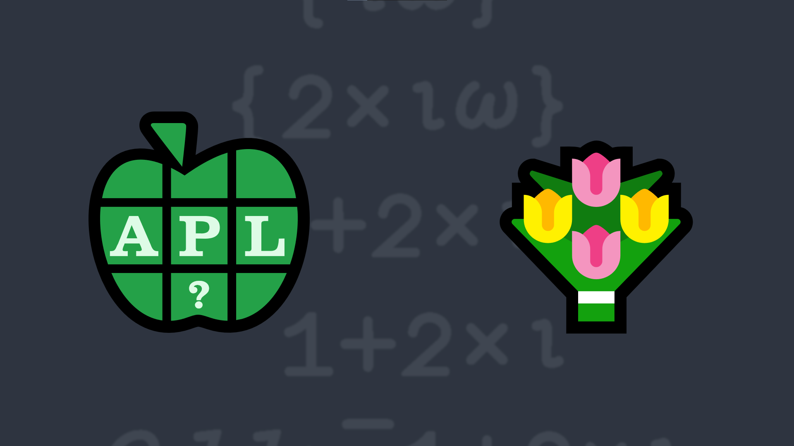

# 1: What an Odd Bunch
Write a function that will return the first n odd natural numbers.

### Examples:

```APL
      your_function 5
1 3 5 7 9
      your_function 1
1     
      your_function 0 ⍝ should return an empty vector

```


       
<div class="pdiv">
  <code>your_function ← </code><input id="p_Input" autocomplete="off" spellcheck="false">
  <button onclick="alert$.next`Testing…`;submitSolution`p`" class="md-button">&#x2714; Test</button>
</div>
<blockquote id="p_Output"></blockquote>
??? info "Solutions"
    <div onclick="play(this)">
        
        
    </div>
    [Chat transcript](https://chat.stackexchange.com/transcript/message/62357410#62357410) ∙ [Code on GitHub](https://github.com/abrudz/apl_quest/tree/main/2017/1.apl)
<script>
    testCases={"a":["5","8","10","20","?20"],"b":["0","1"],"f":"{¯1+2×⍳⍵}"}
    play=e=>e.outerHTML=`<iframe src="https://www.youtube.com/embed/afiMn3ACT1U&list=PLYKQVqyrAEj9wDIUyLDGtDAFTKY38BUMN&autoplay=1" title="Seems a Bit Odd To Me (APL Quest 2013-1)" frameborder="0" allow="accelerometer; autoplay; clipboard-write; encrypted-media; gyroscope; picture-in-picture; web-share" referrerpolicy="strict-origin-when-cross-origin" allowfullscreen="" width="1920" height="1080"></iframe>`
    p_Input.focus()
</script>
