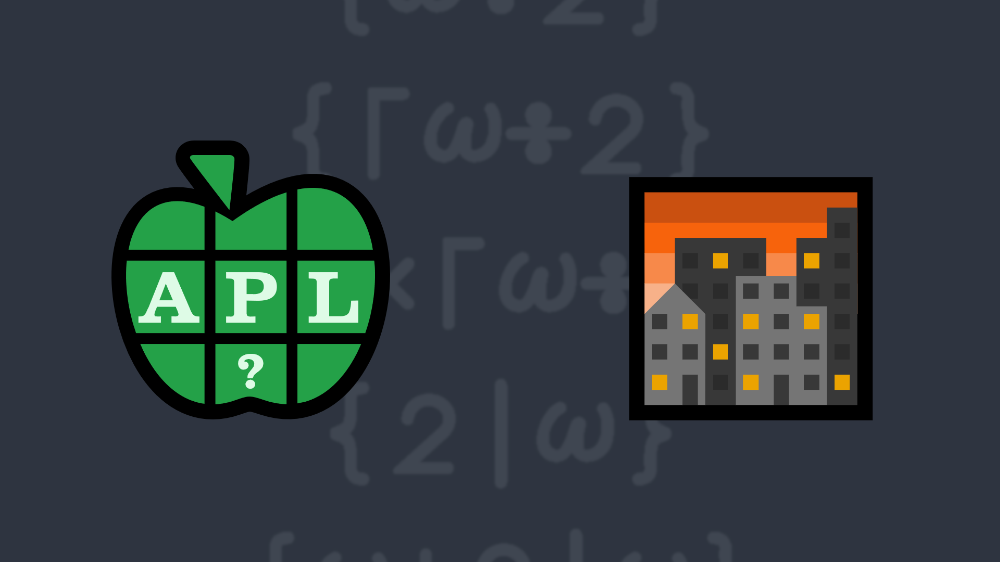

# <span class=s>2017-</span>2: Good Evening
Write a function that takes an integer array and replaces all the odd numbers with the next greater even number.

### Examples:

```APL
     (your_function) 1 2 3 4 5
2 2 4 4 6       
     (your_function) ⍬ ⍝ should return an empty vector      

     (your_function) 4 4⍴⍳16 ⍝ should work with arrays of any rank  
 2  2  4  4
 6  6  8  8
10 10 12 12
14 14 16 16
```


            
<div class="pdiv">
  <code onclick="p_Input.focus()">your_function ← </code><input id="p_Input" autocomplete="off" spellcheck="false" oninput="this.parentElement.querySelector`button`.disabled=false;localStorage.setItem(window.location.pathname,this.value)" onkeypress="subm(event)">
  <button onclick="alert$.next`Testing…`;submitSolution`p`" class="md-button md-button--primary">&#x2714; Test</button>
</div>
<p id="p_Output"></p>
## Solutions
<div onclick="play(this)" title="Video on YouTube" class="yt">

<time>4:56</time>

</div>
<a href="https://chat.stackexchange.com/transcript/52405?m=62397727#62397727" target="_blank" class="md-button md-button--primary">Chat transcript</a>
<a href="https://github.com/abrudz/apl_quest/tree/main/2017/2.apl" target="_blank" class="md-button md-button--primary right">Code on GitHub</a>

<script>
    testCases={"a":["1 2 3 4 5","4 4⍴⍳16","2 3⍴⍳6","⍳20","⍳?20"],"b":["4 4⍴⍳?10","0","(?4 4 4)⍴⍳?10","((?4)⍴?5)⍴⍳?25","¯3 ¯1 ¯4 1 5 9 2","127 32767+?100 100"],"f":"{⍵+2|⍵}"}
    p_Input.value=localStorage.getItem(window.location.pathname)
    play=e=>e.outerHTML=`<iframe class="md-header--shadow" src="https://www.youtube.com/embed/fg1Z0V33Er4?list=PLYKQVqyrAEj9wDIUyLDGtDAFTKY38BUMN&autoplay=1" title="<span class=s>2017-</span>2: Good Evening (APL Quest 2017-2)" frameborder="0" allow="accelerometer; autoplay; clipboard-write; encrypted-media; gyroscope; picture-in-picture; web-share" referrerpolicy="strict-origin-when-cross-origin" allowfullscreen></iframe>`
</script>
