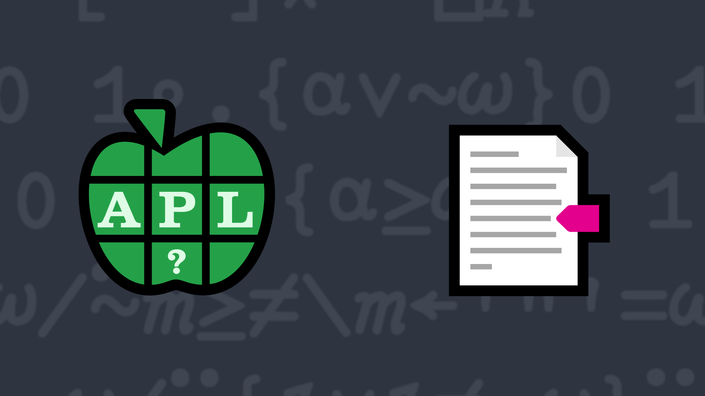

# <span class=s>2017-</span>3: Miss Quoted
<!-- write a function that will remove text found between pairs of double quotes -->
Write a function that will remove text found between pairs of double quotes (`"`).

💡 Hint: One technique is to use `≠\`, but there are many ways to solve this problem.

### Examples:

```APL
     (your_function) 'this "is" a test'
this "" a test
     (your_function) 'this is a test'
this is a test
     (your_function) 'this "is" a "test"'
this "" a ""
     (your_function) ''  ⍝ should return an empty vector

```


             
<div class="pdiv">
  <code onclick="p_Input.focus()">your_function ← </code><input id="p_Input" autocomplete="off" spellcheck="false" oninput="this.parentElement.querySelector`button`.disabled=false;localStorage.setItem(window.location.pathname,this.value)" onkeypress="subm(event)">
  <button onclick="alert$.next`Testing…`;submitSolution`p`" class="md-button md-button--primary">&#x2714; Test</button>
</div>
<blockquote id="p_Output"></blockquote>
## Solutions
<div onclick="play(this)" title="Video on YouTube" class="yt">


</div>
<a href="https://chat.stackexchange.com/transcript/52405?m=62439770#62439770" target="_blank" class="md-button md-button--primary">Chat transcript</a>
<a href="https://github.com/abrudz/apl_quest/tree/main/2017/3.apl" target="_blank" class="md-button md-button--primary right">Code on GitHub</a>

<script>
    testCases={"a":["'this \"is\" a test'","'this is a test'","'this \"is\" a \"test\"'","''","'\"this is a test\"'"],"b":["'\"',⎕A[?10⍴26],'\"'","{⍵,'\"'⍴⍨2|'\"'+.=⍵}(⎕A,'\"')[?50⍴27]","'\"\"'","'\"\"\"\"'"],"f":"{⍵{⍺[⍸0=⍵-⌽1↓⌽(⍵,0)>(0,⍵)]}≠\\'\"'=⍵}"}
    p_Input.value=localStorage.getItem(window.location.pathname)
    play=e=>e.outerHTML=`<iframe src="https://www.youtube.com/embed/Yx3xqiNo9NY?list=PLYKQVqyrAEj9wDIUyLDGtDAFTKY38BUMN&autoplay=1" title="<span class=s>2017-</span>3: Miss Quoted (APL Quest 2017-3)" frameborder="0" allow="accelerometer; autoplay; clipboard-write; encrypted-media; gyroscope; picture-in-picture; web-share" referrerpolicy="strict-origin-when-cross-origin" allowfullscreen></iframe>`
</script>
