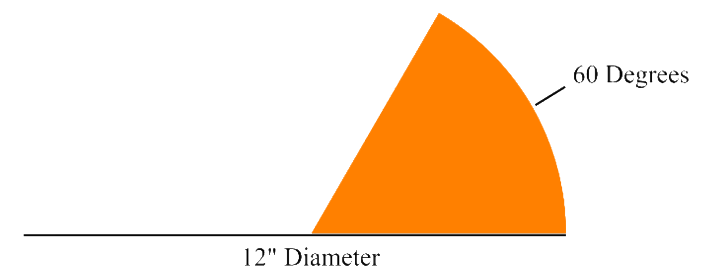
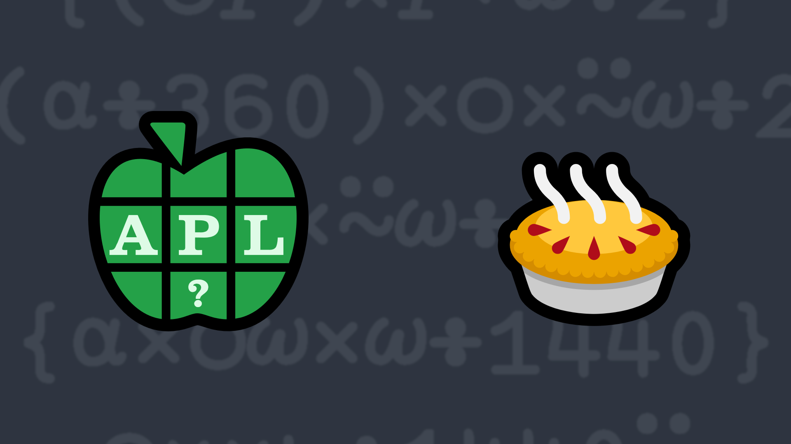

# <span class=s>2017-</span>4: Slice(s) of Pie(s)
Write a function that calculates and returns the areas of 0 or more pie slices. The left argument is 0 or more angles (in degrees). The right argument is 0 or more pie diameters. If the number of angles and diameters are not equal to each other (and neither is a single number), a `LENGTH ERROR` should be generated. 

<div align="center">

</div>

💡 Hint: If you use APL properly, you should not have to check for the length of either argument – it will just work.

### Examples:

```APL
      60 (your_function) 12 
18.84955592 
      0 (your_function) 12  ⍝ 0 degree slice
0
      60 (your_function) 0  ⍝ 0 diameter pie
0
      60 (your_function) 9 12 15  ⍝ 60 degree slices of 3 different pies
10.60287521 18.84955592 29.45243113 
      60 90 120 (your_function) 12 ⍝ 3 different size slices of the same pie 
18.84955592 28.27433388 37.69911184
      60 90 120 (your_function) 9 12 15 ⍝ different sizes of different pies
10.60287521 28.27433388 58.90486225 
      60 90 120 (your_function) 9 12 ⍝ 3 slices, 2 pies? 
LENGTH ERROR
```


          
<div class="pdiv">
  <code onclick="p_Input.focus()">your_function ← </code><input id="p_Input" autocomplete="off" spellcheck="false" oninput="this.parentElement.querySelector`button`.disabled=false;localStorage.setItem(window.location.pathname,this.value)" onkeypress="subm(event)">
  <button onclick="alert$.next`Testing…`;submitSolution`p`" class="md-button md-button--primary">&#x2714; Test</button>
</div>
<p id="p_Output"></p>
## Solutions
<div onclick="play(this)" title="Video on YouTube" class="yt">

<time>12:35</time>

</div>
<a href="https://chat.stackexchange.com/transcript/52405?m=62483171#62483171" target="_blank" class="md-button md-button--primary">Chat transcript</a>
<a href="https://github.com/abrudz/apl_quest/tree/main/2017/4.apl" target="_blank" class="md-button md-button--primary right">Code on GitHub</a>

<script>
    testCases={"a":[["60","12"],["0","12"],["60","9 12 15"],["60","0"],["60 90 120","12"],["60 90 120","9 12 15"]],"b":[["60 90 120","9 12 15"],["?90 90 90 90","?20 20 20 20"]],"f":"{○((⍵*2)÷4)×⍺÷360}"}
    p_Input.value=localStorage.getItem(window.location.pathname)
    play=e=>e.outerHTML=`<iframe src="https://www.youtube.com/embed/XLrh6HwUbP8?list=PLYKQVqyrAEj9wDIUyLDGtDAFTKY38BUMN&autoplay=1" title="<span class=s>2017-</span>4: Slice(s) of Pie(s) (APL Quest 2017-4)" frameborder="0" allow="accelerometer; autoplay; clipboard-write; encrypted-media; gyroscope; picture-in-picture; web-share" referrerpolicy="strict-origin-when-cross-origin" allowfullscreen></iframe>`
</script>
