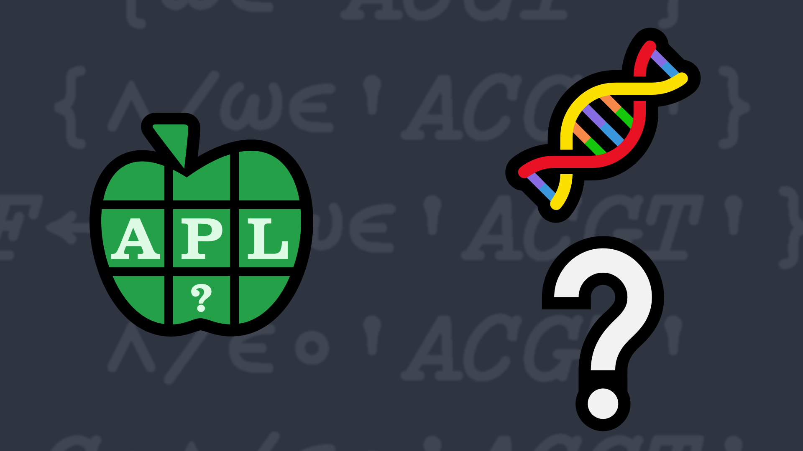

# 5: DNA?
Write a a function that takes a string representing a nucleotide and returns a `1` if it is a valid DNA string, `0` otherwise. In other words, are all the characters in the string in the set `'ACGT'`?

### Examples:

```APL
      your_function 'ATGCTTCAGAAAGGTCTTACG'
1
      your_function 'Dyalog'
0
      your_function ''       ⍝ an empty string is valid
1
      your_function 'T'      
1  
```


                     
<div class="pdiv">
  <code>your_function ← </code><input id="p_Input" autocomplete="off" spellcheck="false">
  <button onclick="alert$.next`Testing…`;submitSolution`p`" class="md-button">&#x2714; Test</button>
</div>
<blockquote id="p_Output"></blockquote>
??? info "Solutions"
    <div onclick="play(this)">
        
        
    </div>

    [Chat transcript](https://chat.stackexchange.com/transcript/message/62538000#62538000)&emsp;∙&emsp;[Code on GitHub](https://github.com/abrudz/apl_quest/tree/main/2017/5.apl)
<script>
    testCases={"a":["'Dyalog'","'ATGCTTCAGAAAGGTCTTACG'","'T'","'ACGT'"],"b":["''","(?50)⍴'ACGT'"],"f":"{(≢⍵)=+/+⌿'ACGT'∘.=⍵}"}
    play=e=>e.outerHTML=`<iframe src="https://www.youtube.com/embed/s2XtJKB1Sks" title="5: DNA? (APL Quest 2017-5)" frameborder="0" allow="accelerometer; autoplay; clipboard-write; encrypted-media; gyroscope; picture-in-picture; web-share" referrerpolicy="strict-origin-when-cross-origin" allowfullscreen></iframe>`
    p_Input.focus()
</script>
