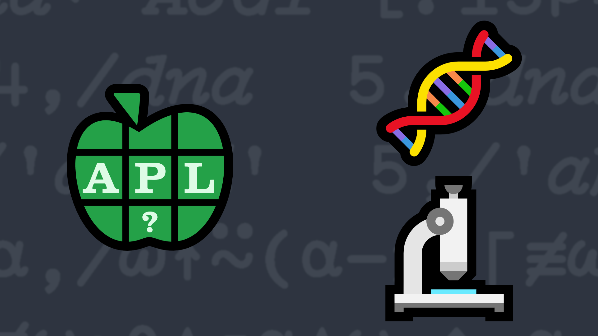

# <span class=s>2017-</span>6: k-mers
The term k-mer typically refers to all the possible substrings of length k that are contained in a string. In computational genomics, k-mers refer to all the possible subsequences (of length k) from a read obtained through DNA Sequencing. Write a dfn that takes a character vector as its right argument and k (the substring length) as its left argument and returns a vector of the k-mers of the original string.

### Examples:

```APL
      4 (your_function) 'ATCGAAGGTCGT'
┌────┬────┬────┬────┬────┬────┬────┬────┬────┐
│ATCG│TCGA│CGAA│GAAG│AAGG│AGGT│GGTC│GTCG│TCGT│
└────┴────┴────┴────┴────┴────┴────┴────┴────┘
      4 (your_function) 'AC'    ⍝  k>string length? Return an empty vector

```

                  
<div class="pdiv">
  <code onclick="p_Input.focus()">your_function ← </code><input id="p_Input" autocomplete="off" spellcheck="false" oninput="this.parentElement.querySelector`button`.disabled=false;localStorage.setItem(window.location.pathname,this.value)" onkeypress="subm(event)">
  <button onclick="alert$.next`Testing…`;submitSolution`p`" class="md-button md-button--primary">&#x2714; Test</button>
</div>
<blockquote id="p_Output"></blockquote>
## Solutions
<div onclick="play(this)" title="Video on YouTube" class="yt">


</div>
<a href="https://chat.stackexchange.com/transcript/message/62581736#62581736" target="_blank" class="md-button md-button--primary">Chat transcript</a>
<a href="https://github.com/abrudz/apl_quest/tree/main/2017/6.apl" target="_blank" class="md-button md-button--primary right">Code on GitHub</a>

<script>
    testCases={"a":[["4","'ATCGAAGGTCGT'"],["5","⎕A[?20⍴26]"],["?10","⎕A[?20⍴26]"]],"b":[["4","'AC'"],["1","'ATCGAAGGTCGT'"],["4","''"],["?5","⎕A[?(?26)⍴26]"],["20","⎕A[?20⍴26]"],["?5","'ACGT'[?(?26)⍴4]"]],"f":"(-⊣)↓⊣,/⊢,⍴","p":"0,,¨"}
    p_Input.value=localStorage.getItem(window.location.pathname)
    play=e=>e.outerHTML=`<iframe src="https://www.youtube.com/embed/SYcEnkcV5q8?list=PLYKQVqyrAEj9wDIUyLDGtDAFTKY38BUMN&autoplay=1" title="<span class=s>2017-</span>6: k-mers (APL Quest 2017-6)" frameborder="0" allow="accelerometer; autoplay; clipboard-write; encrypted-media; gyroscope; picture-in-picture; web-share" referrerpolicy="strict-origin-when-cross-origin" allowfullscreen></iframe>`
</script>
