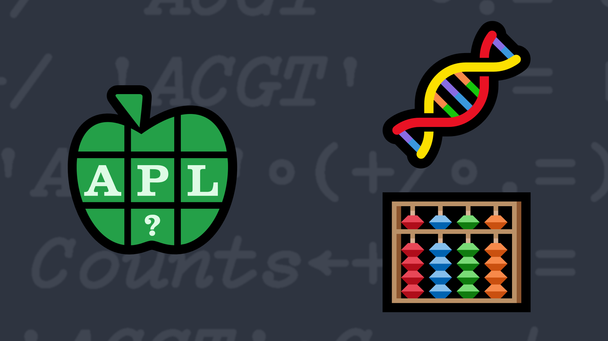

# <span class=s>2017-</span>7: Counting DNA Nucleotides
Write a function that takes a character vector representing a DNA string and returns 4 integers of the number of occurrences for each of the symbols 'A', 'C', 'G', and 'T' respectively.

### Examples:

```APL
     (your_function) 'AGCTTTTCATTCTGACTGCTGTCTTTAAAAAAAGAGTGTCTGATAGCAG' 
14 8 10 17
     (your_function) 'CCAAATGGGG'
3 2 4 1
     (your_function) ''
0 0 0 0
     (your_function) ,'G'
0 0 1 0
```
<div class="pdiv">
  <code onclick="p_Input.focus()">your_function ← </code><input id="p_Input" autocomplete="off" spellcheck="false" oninput="this.parentElement.querySelector`button`.disabled=false;localStorage.setItem(window.location.pathname,this.value)" onkeypress="subm(event)">
  <button onclick="alert$.next`Testing…`;submitSolution`p`" class="md-button md-button--primary">&#x2714; Test</button>
</div>
<blockquote id="p_Output"></blockquote>
## Solutions
<div onclick="play(this)" title="Video on YouTube" class="yt">


</div>
<a href="https://chat.stackexchange.com/transcript/message/62628046#62628046" target="_blank" class="md-button md-button--primary">Chat transcript</a>
<a href="https://github.com/dyalog/apl.quest/tree/main/2017/7.apl" target="_blank" class="md-button md-button--primary right">Code on GitHub</a>

<script>
    testCases={"a":["'CCAAATGGGG'","'AGCTTTTCATTCTGACTGCTGTCTTTAAAAAAAGAGTGTCTGATAGCAG'",",'T'","'GACT'"],"b":["''","'CCCCCCCCCCCCCCCC'"],"f":"{+/'ACGT'∘.=⍵}"}
    p_Input.value=localStorage.getItem(window.location.pathname)
    play=e=>e.outerHTML=`<iframe src="https://www.youtube.com/embed/0TJkzDIWAno?list=PLYKQVqyrAEj9wDIUyLDGtDAFTKY38BUMN&autoplay=1" title="<span class=s>2017-</span>7: Counting DNA Nucleotides (APL Quest 2017-7)" frameborder="0" allow="accelerometer; autoplay; clipboard-write; encrypted-media; gyroscope; picture-in-picture; web-share" referrerpolicy="strict-origin-when-cross-origin" allowfullscreen></iframe>`
</script>
