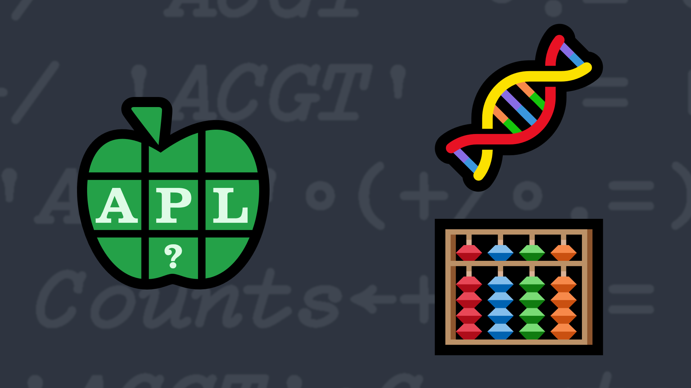

# 7: Counting DNA Nucleotides
Write a function that takes a character vector representing a DNA string and returns 4 integers of the number of occurrences for each of the symbols 'A', 'C', 'G', and 'T' respectively.

### Examples:

```APL
      your_function 'AGCTTTTCATTCTGACTGCTGTCTTTAAAAAAAGAGTGTCTGATAGCAG' 
14 8 10 17
      your_function 'CCAAATGGGG'
3 2 4 1
      your_function ''
0 0 0 0
      your_function ,'G'
0 0 1 0
```
<div class="pdiv">
  <code>your_function ← </code><input id="p_Input" autocomplete="off" spellcheck="false">
  <button onclick="alert$.next`Testing…`;submitSolution`p`" class="md-button">&#x2714; Test</button>
</div>
<blockquote id="p_Output"></blockquote>
??? info "Solutions"
    <div onclick="play(this)">
        
        
    </div>
    [Chat transcript](https://chat.stackexchange.com/transcript/message/62628046#62628046) ∙ [Code on GitHub](https://github.com/abrudz/apl_quest/tree/main/2017/7.apl)
<script>
    testCases={"a":["'CCAAATGGGG'","'AGCTTTTCATTCTGACTGCTGTCTTTAAAAAAAGAGTGTCTGATAGCAG'",",'T'","'GACT'"],"b":["''","'CCCCCCCCCCCCCCCC'"],"f":"{+/'ACGT'∘.=⍵}"}
    play=e=>e.outerHTML=`<iframe src="https://www.youtube.com/embed/0TJkzDIWAno&list=PLYKQVqyrAEj9wDIUyLDGtDAFTKY38BUMN&autoplay=1" title="Seems a Bit Odd To Me (APL Quest 2013-1)" frameborder="0" allow="accelerometer; autoplay; clipboard-write; encrypted-media; gyroscope; picture-in-picture; web-share" referrerpolicy="strict-origin-when-cross-origin" allowfullscreen="" width="1920" height="1080"></iframe>`
    p_Input.focus()
</script>
