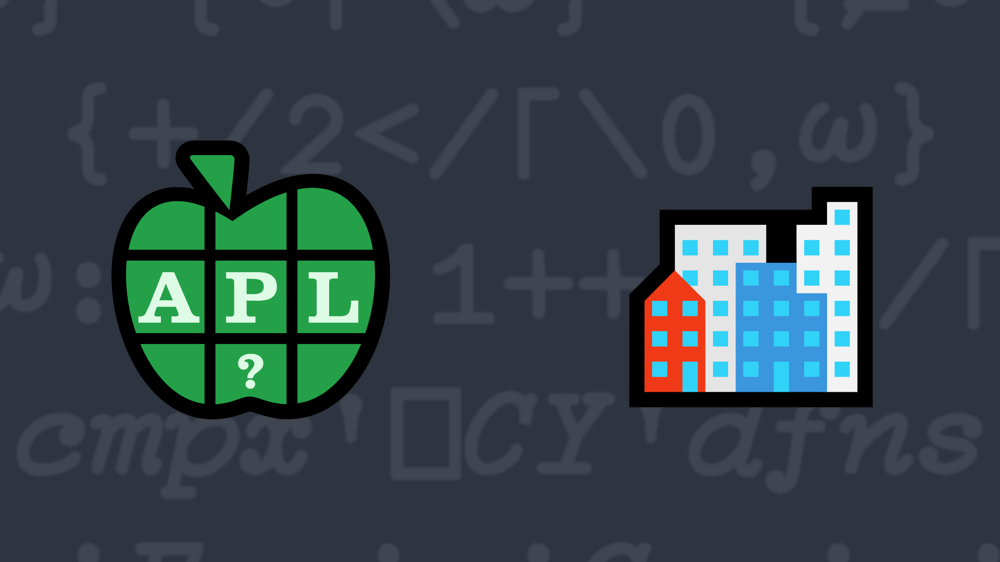

# 1: Oh Say Can You See?

Imagine standing in front of a line of skyscrapers of varying heights.  Assume that you can always see a skyscraper that is taller than a closer skyscraper. For example, a person on the left of the diagram below can see 3 skyscrapers – the first, fourth, and sixth from left to right. In contrast, a person on the right can see 2 skyscrapers – the seventh and sixth. 

<pre id="skyline" class="language-APL">
                                        ┌───┐        
                                        │   │
                                        │   │
                                        │   │
                                        │   │
                          ┌───┐         │   │  ┌───┐
                          │   │         │   │  │   │       
                          │   │         │   │  │   │ 
                          │   │         │   │  │   │  
                          │   │         │   │  │   │
     ┌───┐  ┌───┐         │   │         │   │  │   │ 
     │   │  │   │         │   │         │   │  │   │ 
     │   │  │   │         │   │  ┌───┐  │   │  │   │
     │   │  │   │  ┌───┐  │   │  │   │  │   │  │   │
     │   │  │   │  │   │  │   │  │   │  │   │  │   │ 
     │ 5 │  │ 5 │  │ 2 │  │<span> </span>10<span> </span>│  │ 3 │  │<span> </span>15<span> </span>│  │<span> </span>10<span> </span>│ 
    ─┘   └──┘   └──┘   └──┘   └──┘   └──┘   └──┘   └─
</pre>

Write an APL expression that, given a scalar or vector of skyscraper heights from closest to furthest, will return an integer representing the number of skyscrapers that can be seen.

### Examples:

```APL
      your_function 5 5 2 10 3 15 10 ⍝ from the left person's view
3
      your_function ⌽ 5 5 2 10 3 15 10 ⍝ from the right person's view
2
      your_function ⍬   ⍝ no skyscrapers here!
0
      your_function 10  ⍝ single skyscraper
1
```
<div class="pdiv">
  <code>your_function ← </code><input id="p_Input" autocomplete="off" spellcheck="false">
  <button onclick="alert$.next`Testing…`;submitSolution`p`" class="md-button">&#x2714; Test</button>
</div>
<blockquote id="p_Output"></blockquote>
??? info "Solutions"
    <div onclick="play(this)">
        
        
    </div>
    [Chat transcript](https://chat.stackexchange.com/transcript/message/62357410#62357410) ∙ [Code on GitHub](https://github.com/abrudz/apl_quest/tree/main/2018/1.apl)
<script>
    testCases={"a":["5 5 2 10 3 15 10","⌽ 5 5 2 10 3 15 10","10","?10⍴10"],"b":["⍬","(?10)⍴5","(?10)⍴?10"],"f":"{≢∪⌈\\⍵}","p":"{,⍵}"}
    play=e=>e.outerHTML=`<iframe src="https://www.youtube.com/embed/YZBOKebM624&list=PLYKQVqyrAEj9wDIUyLDGtDAFTKY38BUMN&autoplay=1" title="Seems a Bit Odd To Me (APL Quest 2013-1)" frameborder="0" allow="accelerometer; autoplay; clipboard-write; encrypted-media; gyroscope; picture-in-picture; web-share" referrerpolicy="strict-origin-when-cross-origin" allowfullscreen="" width="1920" height="1080"></iframe>`
    p_Input.focus()
</script>
