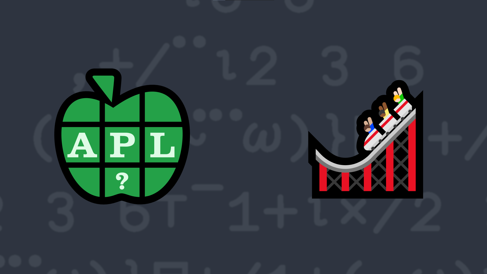

# <span class=s>2018-</span>3: Rolling Along

Using the key operator [`⌸`](http://help.dyalog.com/latest/#Language/Primitive%20Operators/Key.htm), write an APL function that, given an integer scalar or vector representing the number of sides on each of a set of dice, will return a histogram showing the distribution curve for the possible totals that can be rolled using those dice. The histogram is a 2-column matrix where the left column contains the possible totals for the dice, and the right column has vectors containing asterisks representing the number of occurrences of the corresponding totals.  Trailing spaces are allowed in the character vectors.

Note: If you have `]boxing on` then the result will look different.

### Examples:

```APL
     (your_function) 6 6   ⍝ 2 6-sided dice
 2  *     
 3  **      
 4  ***    
 5  ****      
 6  *****   
 7  ****** 
 8  *****   
 9  ****      
10  ***    
11  **
12  *
     (your_function) 6  ⍝ 1 6-sided die (flat distribution)
1  *  
2  *  
3  *  
4  *  
5  *  
6  * 
     (your_function) 5 3 4 ⍝ 5, 3, and 4-sided dice
 3  *            
 4  ***          
 5  ******
 6  *********     
 7  ***********  
 8  ***********  
 9  *********    
10  ******
11  ***          
12  *
     (your_function) ⍬ ⍝ no dice
0  *   
```
<div class="pdiv">
  <code onclick="p_Input.focus()">your_function ← </code><input id="p_Input" autocomplete="off" spellcheck="false" oninput="this.parentElement.querySelector`button`.disabled=false;localStorage.setItem(window.location.pathname,this.value)" onkeypress="subm(event)">
  <button onclick="alert$.next`Testing…`;submitSolution`p`" class="md-button md-button--primary">&#x2714; Test</button>
</div>
<blockquote id="p_Output"></blockquote>
## Solutions
<div onclick="play(this)" title="Video on YouTube" class="yt">

<time>13:03</time>

</div>
<a href="https://chat.stackexchange.com/transcript/message/62907248#62907248" target="_blank" class="md-button md-button--primary">Chat transcript</a>
<a href="https://github.com/abrudz/apl_quest/tree/main/2018/3.apl" target="_blank" class="md-button md-button--primary right">Code on GitHub</a>

<script>
    testCases={"a":["6 6","5 4 3","?10 10 10","6","10","8 1 1 1","1,?6 6 6"],"b":["?(?5)⍴8","⍬","?(?6)⍴?10","⍬,?10","(?10)⍴1","16⍴2"],"f":"{⍬≡⍵:⍉⍪0(,'*') ⋄ {⍺('*'⍴⍨≢⍵)}⌸⊃(,∘.+)/⍳¨⍵}"}
    p_Input.value=localStorage.getItem(window.location.pathname)
    play=e=>e.outerHTML=`<iframe src="https://www.youtube.com/embed/D6jWkFo00-E?list=PLYKQVqyrAEj9wDIUyLDGtDAFTKY38BUMN&autoplay=1" title="<span class=s>2018-</span>3: Rolling Along (APL Quest 2018-3)" frameborder="0" allow="accelerometer; autoplay; clipboard-write; encrypted-media; gyroscope; picture-in-picture; web-share" referrerpolicy="strict-origin-when-cross-origin" allowfullscreen></iframe>`
</script>
