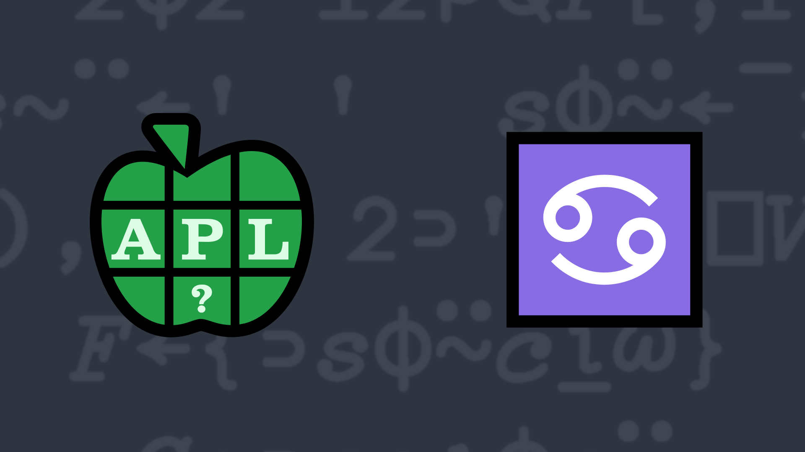

# <span class=s>2018-</span>5: What's Your Sign? Revisited

In Western astrology, the Zodiac is based on twelve 30° sectors of the ecliptic. Although the exact dates in a given year may shift by a day, the general dates for each sign are:

<div align="center" markdown="1">

|   |   |   |
|-
|Aries|March 21–April 19|Libra|September 23–October 22|
|-
|Taurus|April 20–May 20|Scorpio|October 23–November 21|
|-
|Gemini|May 21–June 20|Sagittarius|November 22–December 21|
|-
|Cancer|June 21–July 22|Capricorn|December 22–January 19|
|-
|Leo|July 23–August 22|Aquarius|January 20–February 18|
|-
|Virgo|August 23–September 22|Pisces|February 19–March 20|

</div>

Write an APL expression that, given a 2-element integer vector representing month and day, returns a character vector (string) of the corresponding Western zodiac sign.

### Examples:

```APL
      your_function 2 23    ⍝ February 23
Pisces
      your_function 10 31   ⍝ October 31
Scorpio
```
<div class="pdiv">
  <code onclick="p_Input.focus()">your_function ← </code><input id="p_Input" autocomplete="off" spellcheck="false" oninput="this.parentElement.querySelector`button`.disabled=false" onkeypress="subm(event)">
  <button onclick="alert$.next`Testing…`;submitSolution`p`" class="md-button md-button--primary">&#x2714; Test</button>
</div>
<blockquote id="p_Output"></blockquote>
## Solutions
<div onclick="play(this)" title="Video on YouTube" class="yt">


</div>
<a href="https://chat.stackexchange.com/transcript/52405?m=63010133#63010133" target="_blank" class="md-button md-button--primary">Chat transcript</a>
<a href="https://github.com/abrudz/apl_quest/tree/main/2018/5.apl" target="_blank" class="md-button md-button--primary right">Code on GitHub</a>

<script>
    testCases={"a":["2 23","10 31","1 1","12 31","?12,?29"],"b":["7 22","6 21","12 21","4 19","4 20"],"f":"{↑{'Capricorn' 'Aquarius' 'Pisces' 'Aries' 'Taurus' 'Gemini' 'Cancer' 'Leo' 'Virgo' 'Libra' 'Scorpio' 'Sagittarius' 'Capricorn'[0 1 2 3 4 5 6 7 8 9 10 11 12⍸⍵]}(12 2⍴1 20 2 19 3 21 4 20 5 21 6 21 7 23 8 23 9 23 10 23 11 22 12 22)⍸⍵}"}
    play=e=>e.outerHTML=`<iframe src="https://www.youtube.com/embed/BtJ6Hey2PE4?list=PLYKQVqyrAEj9wDIUyLDGtDAFTKY38BUMN&autoplay=1" title="<span class=s>2018-</span>5: What's Your Sign? Revisited (APL Quest 2018-5)" frameborder="0" allow="accelerometer; autoplay; clipboard-write; encrypted-media; gyroscope; picture-in-picture; web-share" referrerpolicy="strict-origin-when-cross-origin" allowfullscreen></iframe>`
</script>
