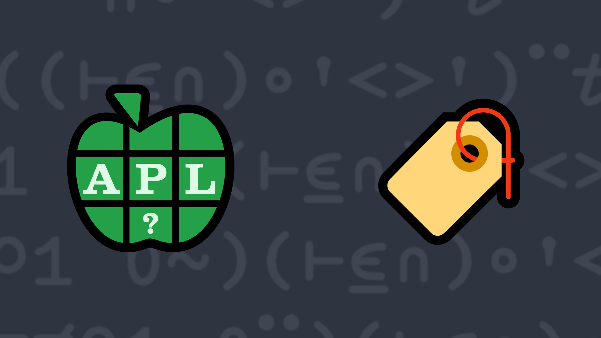

# <span class=s>2018-</span>6: What's Your Angle?

XML elements are denoted with content enclosed in beginning and ending tags. The tags themselves are enclosed in left and right angle brackets `<`  and `>`. The only valid occurrences of angle brackets are as a part of beginning or ending tags.

For example, the following is valid  
```XML
<name><first>Drake</first><last>Mallard</last></name>
```

Whereas the following is not valid XML  
```XML
<math><relation>2<3</relation></math>
```

One easy validation is to check that the angle brackets are properly balanced – all left angle brackets `<` must be "closed" with right angle brackets `>` before another occurrence of a left angle bracket. 

Write an APL function that, given a character scalar or vector representing some XML, returns 1 if the angle brackets are properly balanced and 0 if not.

### Examples:

```APL
     (your_function) '<name><first>Drake</first><last>Mallard</last></name>' 
1
     (your_function) '<math><relation>2<3</relation></math>' 
0
     (your_function) ''   ⍝ an empty vector is balanced
1
     (your_function) '>stuff<>/stuff<' 
0
     (your_function) '<' 
0 
```
<div class="pdiv">
  <code onclick="p_Input.focus()">your_function ← </code><input id="p_Input" autocomplete="off" spellcheck="false" oninput="this.parentElement.querySelector`button`.disabled=false;localStorage.setItem(window.location.pathname,this.value)" onkeypress="subm(event)">
  <button onclick="alert$.next`Testing…`;submitSolution`p`" class="md-button md-button--primary">&#x2714; Test</button>
</div>
<blockquote id="p_Output"></blockquote>
## Solutions
<div onclick="play(this)" title="Video on YouTube" class="yt">


</div>
<a href="https://chat.stackexchange.com/transcript/52405?m=63056863#63056863" target="_blank" class="md-button md-button--primary">Chat transcript</a>
<a href="https://github.com/dyalog/apl.quest/tree/main/2018/6.apl" target="_blank" class="md-button md-button--primary right">Code on GitHub</a>

<script>
    testCases={"a":["'<name><first>Drake</first><last>Mallard</last></name>'","'<math><relation>2<3</relation></math>'","'>stuff<>/stuff<'","'<'","'<><><><><><><><>'"],"b":["''","'<name<>first>'","'>name><first<'","'<><name><><first><>'","'><'","'name<first>Drake</first><last>Mallard</last>/name'"],"f":"((⊢≡≠⍀⍤=⍨)⊢⍷∩)∘'<>'"}
    p_Input.value=localStorage.getItem(window.location.pathname)
    play=e=>e.outerHTML=`<iframe src="https://www.youtube.com/embed/3ivJvycE0Tk?list=PLYKQVqyrAEj9wDIUyLDGtDAFTKY38BUMN&autoplay=1" title="<span class=s>2018-</span>6: What's Your Angle? (APL Quest 2018-6)" frameborder="0" allow="accelerometer; autoplay; clipboard-write; encrypted-media; gyroscope; picture-in-picture; web-share" referrerpolicy="strict-origin-when-cross-origin" allowfullscreen></iframe>`
</script>
