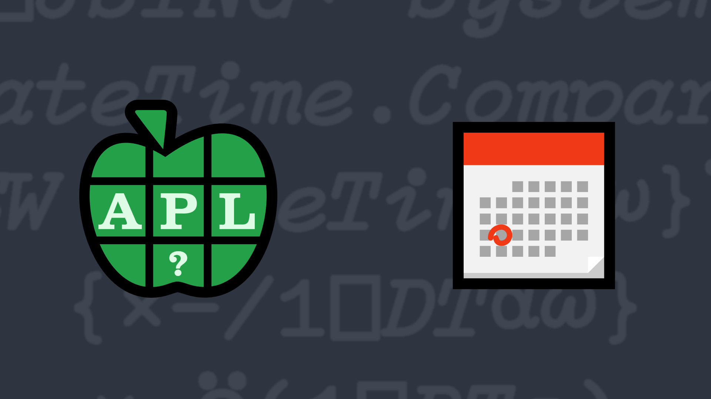

# <span class=s>2018-</span>9: Earlier, Later, or the Same?

The system function [`⎕TS`](http://help.dyalog.com/latest/#Language/System%20Functions/ts.htm?) returns a 7-element integer vector timestamp representing the current year, month, day, hour, minute, second, and millisecond in that order. 

Write an APL function that given left and right arguments of such timestamps returns a `¯1`, `1`, or `0` if the left argument represents a time that is respectively, earlier than, later than, or simultaneous with the right argument.

### Examples:

```APL
      2018 4 1 12 34 56 789 (your_function) 2018 4 1 16 45 12 800
¯1
      2018 4 1 12 34 56 789 (your_function) 2018 4 1 12 34 56 789
0
      2018 4 1 12 34 56 789 (your_function) 2017 4 1 12 34 56 789 
1
```
<div class="pdiv">
  <code onclick="p_Input.focus()">your_function ← </code><input id="p_Input" autocomplete="off" spellcheck="false" oninput="this.parentElement.querySelector`button`.disabled=false;localStorage.setItem(window.location.pathname,this.value)" onkeypress="subm(event)">
  <button onclick="alert$.next`Testing…`;submitSolution`p`" class="md-button md-button--primary">&#x2714; Test</button>
</div>
<blockquote id="p_Output"></blockquote>
## Solutions
<div onclick="play(this)" title="Video on YouTube" class="yt">


</div>
<a href="https://chat.stackexchange.com/transcript/52405?m=63197530#63197530" target="_blank" class="md-button md-button--primary">Chat transcript</a>
<a href="https://github.com/dyalog/apl.quest/tree/main/2018/9.apl" target="_blank" class="md-button md-button--primary right">Code on GitHub</a>

<script>
    testCases={"a":[["2018 4 1 12 34 56 789","2018 4 1 16 45 12 800"],["2018 4 1 12 34 56 789"," 2017 4 1 12 34 56 789"],["?5000 12 29 24 60 60","?5000 12 29 24 60 60"]],"b":[["2018 4 1 12 34 56 789","2018 4 1 12 34 56 789"],["0 0 0 0 0 0 0","0 0 0 0 0 0 0"],["0 0 0 0 0 0 0","2018 4 1 16 45 12 800"]],"f":"{((0~⍨×⍺-⍵),0)[1]}"}
    p_Input.value=localStorage.getItem(window.location.pathname)
    play=e=>e.outerHTML=`<iframe src="https://www.youtube.com/embed/gPQpCa0ke0U?list=PLYKQVqyrAEj9wDIUyLDGtDAFTKY38BUMN&autoplay=1" title="<span class=s>2018-</span>9: Earlier, Later, or the Same? (APL Quest 2018-9)" frameborder="0" allow="accelerometer; autoplay; clipboard-write; encrypted-media; gyroscope; picture-in-picture; web-share" referrerpolicy="strict-origin-when-cross-origin" allowfullscreen></iframe>`
</script>
