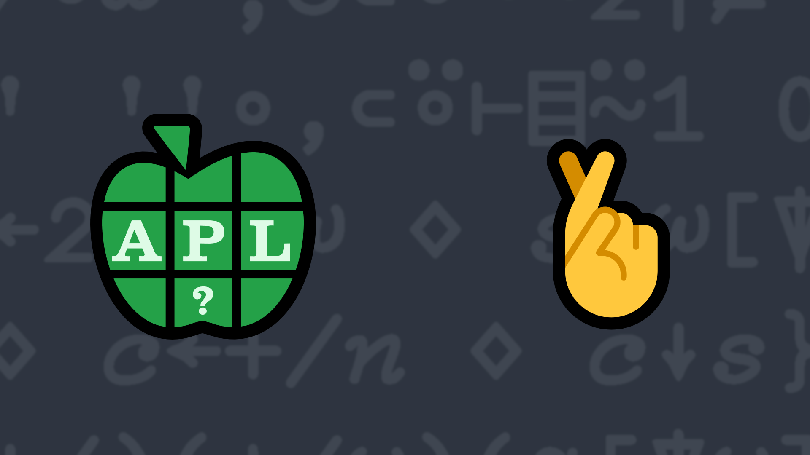

# <span class=s>2019-</span>10: Odds & Evens
<!-- Write a function that, given a vector of words, separates the words into two vectors – one containing all the words that have an odd number of letters and the other containing all the words that have an even number of letters. -->
Given a vector of words, separate the words into two vectors – one containing all the words that have an odd number of letters and the other containing all the words that have an even number of letters.

💡 Hint: You may want to look into the dyadic form of the key operator [`X f⌸ Y`](http://help.dyalog.com/latest/Content/Language/Primitive%20Operators/Key.htm).

### Examples:

```APL
      (your_function) 'the' 'plan' 'is' 'great'   ⍝ ]box on is used to display theresult
┌───────────┬─────────┐
│┌───┬─────┐│┌────┬──┐│
││the│great│││plan│is││
│└───┴─────┘│└────┴──┘│
└───────────┴─────────┘
      (your_function) 'all' 'odd' ⍝ note the empty 2nd element of the result
┌─────────┬┐
│┌───┬───┐││
││all│odd│││
│└───┴───┘││
└─────────┴┘
      (your_function) 'only' 'even' 'here' ⍝ note the empty 1st element of the result
┌┬────────────────┐
││┌────┬────┬────┐│
│││only│even│here││
││└────┴────┴────┘│
└┴────────────────┘
```
<div class="pdiv">
  <code onclick="p_Input.focus()">your_function ← </code><input id="p_Input" autocomplete="off" spellcheck="false" oninput="this.parentElement.querySelector`button`.disabled=false;localStorage.setItem(window.location.pathname,this.value)" onkeypress="subm(event)">
  <button onclick="alert$.next`Testing…`;submitSolution`p`" class="md-button md-button--primary">&#x2714; Test</button>
</div>
<p id="p_Output"></p>
## Solutions
<div onclick="play(this)" title="Video on YouTube" class="yt">

<time>15:33</time>

</div>
<a href="https://chat.stackexchange.com/transcript/52405?m=63718568#63718568" target="_blank" class="md-button md-button--primary">Chat transcript</a>
<a href="https://github.com/abrudz/apl_quest/tree/main/2019/10.apl" target="_blank" class="md-button md-button--primary right">Code on GitHub</a>

<script>
    testCases={"a":["'the' 'plan' 'is' 'great'","'all' 'odd'","'only' 'even' 'here'","{(⎕A,819⌶⎕A)[?⍴⍨⍵]⊂⍨(⍳⍵)∊⍵?⍨3+?7}52"],"b":[",⊂'one'",",⊂'lone'","0⍴⊂''"],"f":"{1↓¨{(2|≢¨⍵){⊂⍵}⌸⍵}'i' 'ii',⍵}","p":"{0=≢⍵:⍬⋄⍵}¨"}
    p_Input.value=localStorage.getItem(window.location.pathname)
    play=e=>e.outerHTML=`<iframe class="md-header--shadow" src="https://www.youtube.com/embed/9hUTqexYZ0I?list=PLYKQVqyrAEj9wDIUyLDGtDAFTKY38BUMN&autoplay=1" title="<span class=s>2019-</span>10: Odds & Evens (APL Quest 2019-10)" frameborder="0" allow="accelerometer; autoplay; clipboard-write; encrypted-media; gyroscope; picture-in-picture; web-share" referrerpolicy="strict-origin-when-cross-origin" allowfullscreen></iframe>`
</script>
