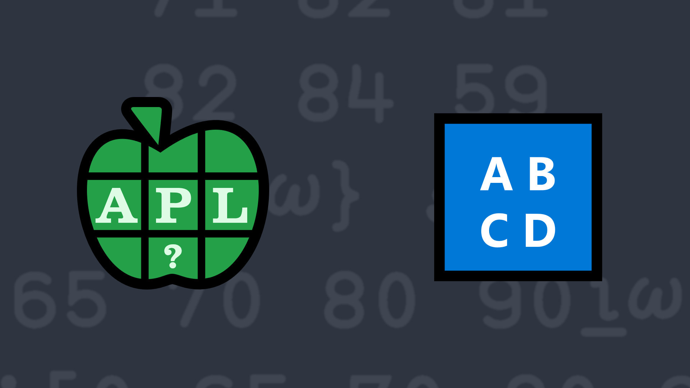

# <span class=s>2019-</span>2: Making the Grade
<div class="mr left">
<table>
  <tr>
    <td>Score Range</td><td>Letter Grade</td>
  </tr><tr>
    <td>0–64</td><td>F</td>
  </tr><tr>
    <td>65–69</td><td>D</td>
  </tr><tr>
    <td>70–79</td><td>C</td>
  </tr><tr>
    <td>80–89</td><td>B</td>
  </tr><tr>
    <td>90–100</td><td>A</td>    
  </tr>
</table>
</div>
<!-- Write a function that, given an array of integer test scores in the inclusive range 0–100, returns an identically-shaped array of the corresponding letter grades. -->
Write a function that, given an array of integer test scores in the inclusive range 0–100, returns an identically-shaped array of the corresponding letter grades according to the table to the left.

💡 Hint: You may want to investigate the *interval index* function [`X⍸Y`](http://help.dyalog.com/latest/Content/Language/Primitive%20Functions/Interval%20Index.htm).

### Examples:

```APL
      (your_function) 0 64 65 69 70 79 80 89 90 100
FFDDCCBBAA

      (your_function) ⍬  ⍝ returns an empty vector


      (your_function) 2 3⍴71 82 81 82 84 59
CBB
BBF
```
<div class="pdiv">
  <code onclick="p_Input.focus()">your_function ← </code><input id="p_Input" autocomplete="off" spellcheck="false" oninput="this.parentElement.querySelector`button`.disabled=false;localStorage.setItem(window.location.pathname,this.value)" onkeypress="subm(event)">
  <button onclick="alert$.next`Testing…`;submitSolution`p`" class="md-button md-button--primary">&#x2714; Test</button>
</div>
<blockquote id="p_Output"></blockquote>
## Solutions
<div onclick="play(this)" title="Video on YouTube" class="yt">

<time>3:27</time>

</div>
<a href="https://chat.stackexchange.com/transcript/52405?m=63332288#63332288" target="_blank" class="md-button md-button--primary">Chat transcript</a>
<a href="https://github.com/abrudz/apl_quest/tree/main/2019/2.apl" target="_blank" class="md-button md-button--primary right">Code on GitHub</a>

<script>
    testCases={"a":["14 15 92 65 35 89 79","0,⍳100","¯1+?101⍴⍨?2⍴⍨1+?2"],"b":["2 2⍴61 80 33 100","¯1+?101"],"f":"{'FDCBA'[0 65 70 80 90⍸⍵]}","p":"819⌶"}
    p_Input.value=localStorage.getItem(window.location.pathname)
    play=e=>e.outerHTML=`<iframe src="https://www.youtube.com/embed/1EaAau9x8MI?list=PLYKQVqyrAEj9wDIUyLDGtDAFTKY38BUMN&autoplay=1" title="<span class=s>2019-</span>2: Making the Grade (APL Quest 2019-2)" frameborder="0" allow="accelerometer; autoplay; clipboard-write; encrypted-media; gyroscope; picture-in-picture; web-share" referrerpolicy="strict-origin-when-cross-origin" allowfullscreen></iframe>`
</script>
