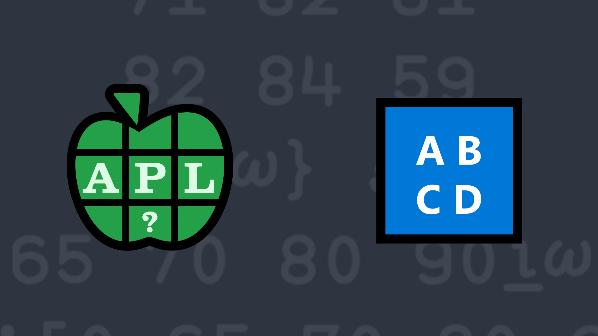

# 2: Making the Grade
<table>
  <tr><td style="border:none;">
    <table>
      <tr>
        <td>Score Range</td><td>Letter Grade</td>
      </tr><tr>
        <td>0–64</td><td>F</td>
      </tr><tr>
        <td>65–69</td><td>D</td>
      </tr><tr>
        <td>70–79</td><td>C</td>
      </tr><tr>
        <td>80–89</td><td>B</td>
      </tr><tr>
        <td>90–100</td><td>A</td>    
      </tr>
    </table>
  </td>
  <td style="border: none;">
    <p>
Write a function that, given an array of integer test scores in the inclusive range 0–100, returns an identically-shaped array of the corresponding letter grades according to the table to the left.
    </p>
  </td></tr>
</table>

💡 Hint: You may want to investigate the *interval index* function [`X⍸Y`](http://help.dyalog.com/latest/Content/Language/Primitive%20Functions/Interval%20Index.htm).

### Examples

```APL
      (your_function) 0 64 65 69 70 79 80 89 90 100
FFDDCCBBAA

      (your_function) ⍬  ⍝ returns an empty vector


      (your_function) 2 3⍴71 82 81 82 84 59
CBB
BBF
```

</div>   
<div class="pdiv">
  <code>your_function ← </code><input id="p_Input" autocomplete="off" spellcheck="false">
  <button onclick="alert$.next`Testing…`;submitSolution`p`" class="md-button">&#x2714; Test</button>
</div>
<blockquote id="p_Output"></blockquote>
??? info "Solutions"
    <div onclick="play(this)">
        
        
    </div>

    [Chat transcript](https://chat.stackexchange.com/transcript/52405?m=63332288#63332288)&emsp;∙&emsp;[Code on GitHub](https://github.com/abrudz/apl_quest/tree/main/2019/2.apl)
<script>
    testCases={"a":["14 15 92 65 35 89 79","0,⍳100","¯1+?101⍴⍨?2⍴⍨1+?2"],"b":["2 2⍴61 80 33 100","¯1+?101"],"f":"{'FDCBA'[0 65 70 80 90⍸⍵]}","p":"819⌶"}
    play=e=>e.outerHTML=`<iframe src="https://www.youtube.com/embed/1EaAau9x8MI" title="2: Making the Grade (APL Quest 2019-2)" frameborder="0" allow="accelerometer; autoplay; clipboard-write; encrypted-media; gyroscope; picture-in-picture; web-share" referrerpolicy="strict-origin-when-cross-origin" allowfullscreen></iframe>`
    p_Input.focus()
</script>
