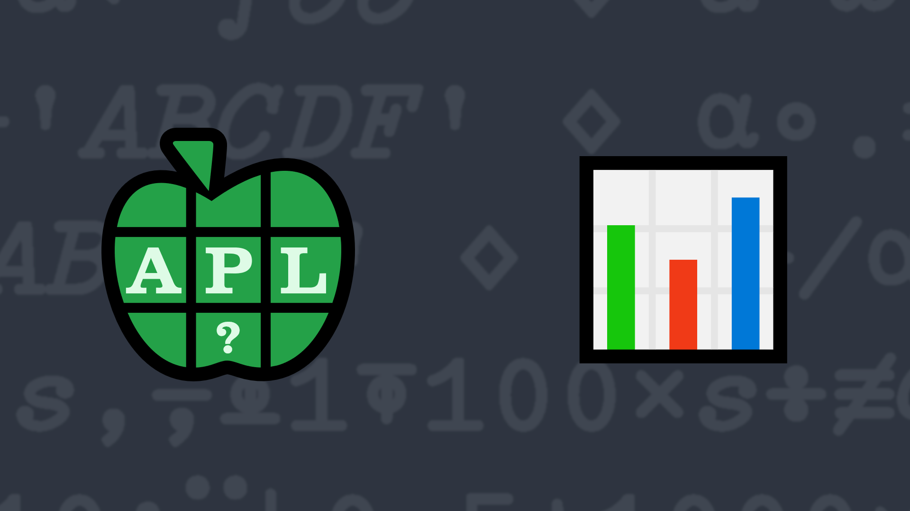

# <span class=s>2019-</span>3: Grade Distribution
<!-- Write a function that produces a 3-column, 5-row, alphabetically-sorted matrix of each grade, the number of occurrences of that grade, and the percentage (rounded to 1 decimal position) of the total number of occurrences of that grade. -->
The school's administrative department wants to publish some simple statistics. Given a non-empty character vector of single-letter grades, produce a 3-column, 5-row, alphabetically-sorted matrix of each grade, the number of occurrences of that grade, and the percentage (rounded to 1 decimal position) of the total number of occurrences of that grade. The table should have a row for each grade even if there are no occurrences of a grade. 

Note: due to rounding the last column might not total 100%.

💡 Hint: The key operator [`⌸`](http://help.dyalog.com/latest/Content/Language/Primitive%20Operators/Key.htm) could be useful for this problem.

### Examples

```APL
      (your_function) 9 3 8 4 7/'DABFC'
A 3  9.7
B 8 25.8
C 7 22.6
D 9 29  
F 4 12.9

      (your_function) 20⍴'ABC'
A 7 35
B 7 35
C 6 30
D 0  0
F 0  0

      (your_function) ,'B'
A 0   0
B 1 100
C 0   0
D 0   0
F 0   0
```
<div class="pdiv">
  <code onclick="p_Input.focus()">your_function ← </code><input id="p_Input" autocomplete="off" spellcheck="false" oninput="this.parentElement.querySelector`button`.disabled=false;localStorage.setItem(window.location.pathname,this.value)" onkeypress="subm(event)">
  <button onclick="alert$.next`Testing…`;submitSolution`p`" class="md-button md-button--primary">&#x2714; Test</button>
</div>
<blockquote id="p_Output"></blockquote>
## Solutions
<div onclick="play(this)" title="Video on YouTube" class="yt">


</div>
<a href="https://chat.stackexchange.com/transcript/52405?m=63374600#63374600" target="_blank" class="md-button md-button--primary">Chat transcript</a>
<a href="https://github.com/abrudz/apl_quest/tree/main/2019/3.apl" target="_blank" class="md-button md-button--primary right">Code on GitHub</a>

<script>
    testCases={"a":["9 5 7 5 4/'DABFC'","20⍴'ABC'","'ABCDF'[?5⍴⍨9+?10]"],"b":["'ABCDF'[,?5]"],"f":"{{⍵,0.1×⌊0.5+1000×⍵[;2]÷+/⍵[;2]}{⍺(¯1+≢⍵)}⌸'ABCDF',⍵}","p":"819⌶@1⍤1"}
    p_Input.value=localStorage.getItem(window.location.pathname)
    play=e=>e.outerHTML=`<iframe src="https://www.youtube.com/embed/uPMqIHcOfgE?list=PLYKQVqyrAEj9wDIUyLDGtDAFTKY38BUMN&autoplay=1" title="<span class=s>2019-</span>3: Grade Distribution (APL Quest 2019-3)" frameborder="0" allow="accelerometer; autoplay; clipboard-write; encrypted-media; gyroscope; picture-in-picture; web-share" referrerpolicy="strict-origin-when-cross-origin" allowfullscreen></iframe>`
</script>
