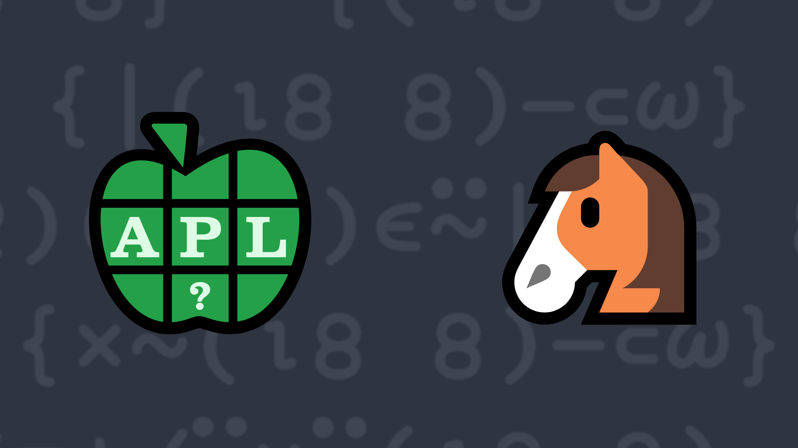

# <span class=s>2019-</span>4: Knight Moves

<style>
.chess {width: 20em;}
.chess td {
    text-align: center;
    height: 2.5em;
    width: 2.5em;
    border: 1px solid var(--md-primary-fg-color);
    line-height: 2.5em;
}

.chess .knight {
    background: #4c566a;
    color: #eceff4;
}

.chess .pos {
    background: #5e81ac;
    color: #eceff4;
}
</style>
<div class="mr left">
  <table class="chess">
    <tbody><tr>
        <td>1 1</td>
        <td>1 2</td>
        <td>1 3</td>
        <td>1 4</td>
        <td>1 5</td>
        <td>1 6</td>
        <td>1 7</td>
        <td>1 8</td>
    </tr>
    <tr>
        <td>2 1</td>
        <td>2 2</td>
        <td>2 3</td>
        <td>2 4</td>
        <td>2 5</td>
        <td>2 6</td>
        <td>2 7</td>
        <td>2 8</td>
    </tr>
    <tr>
        <td>3 1</td>
        <td>3 2</td>
        <td class="pos">3 3</td>
        <td>3 4</td>
        <td class="pos">3 5</td>
        <td>3 6</td>
        <td>3 7</td>
        <td>3 8</td>
    </tr>
    <tr>
        <td>4 1</td>
        <td class="pos">4 2</td>
        <td>4 3</td>
        <td>4 4</td>
        <td>4 5</td>
        <td class="pos">4 6</td>
        <td>4 7</td>
        <td>4 8</td>
    </tr>
    <tr>
        <td>5 1</td>
        <td>5 2</td>
        <td>5 3</td>
        <td class="knight">5 4</td>
        <td>5 5</td>
        <td>5 6</td>
        <td>5 7</td>
        <td>5 8</td>
    </tr>
    <tr>
        <td>6 1</td>
        <td class="pos">6 2</td>
        <td>6 3</td>
        <td>6 4</td>
        <td>6 5</td>
        <td class="pos">6 6</td>
        <td>6 7</td>
        <td>6 8</td>
    </tr>
    <tr>
        <td>7 1</td>
        <td>7 2</td>
        <td class="pos">7 3</td>
        <td>7 4</td>
        <td class="pos">7 5</td>
        <td>7 6</td>
        <td>7 7</td>
        <td>7 8</td>
    </tr>
    <tr>
        <td>8 1</td>
        <td>8 2</td>
        <td>8 3</td>
        <td>8 4</td>
        <td>8 5</td>
        <td>8 6</td>
        <td>8 7</td>
        <td>8 8</td>
    </tr>
</tbody></table>
</div>
<!-- Write a function that, given a 2-element vector representing the current square for a knight, returns a vector of 2-element vectors representing (in any order) all the squares that the knight can move to. -->
Consider a chess board as an 8×8 matrix with square <code class="language-APL">(1 1)</code> in the upper left corner and square <code class="language-APL">(8 8)</code> in the lower right corner. For those not familiar with the game of chess, the knight, generally depicted as a horse (♞), can move 2 spaces right or left and then 1 space up or down, or 2 spaces up or down and then 1 space right or left. This means that a knight on square <code class="language-APL">(5 4)</code> can move to any of the indicated squares. Given a 2-element vector representing the current square for a knight, return a vector of 2-element vectors representing (in any order) all the squares that the knight can move to.

💡 Hint: The outer product operator [`∘.`](http://help.dyalog.com/latest/Content/Language/Primitive%20Operators/Outer%20Product.htm) could be useful for generating the coordinates.

### Examples:

```APL
      (your_function) 5 4   ⍝ ]Box on is used to display the result
┌───┬───┬───┬───┬───┬───┬───┬───┐
│3 3│3 5│4 2│4 6│6 2│6 6│7 3│7 5│
└───┴───┴───┴───┴───┴───┴───┴───┘
      (your_function) 1 1
┌───┬───┐
│2 3│3 2│
└───┴───┘
```
<div class="pdiv">
  <code onclick="p_Input.focus()">your_function ← </code><input id="p_Input" autocomplete="off" spellcheck="false" oninput="this.parentElement.querySelector`button`.disabled=false;localStorage.setItem(window.location.pathname,this.value)" onkeypress="subm(event)">
  <button onclick="alert$.next`Testing…`;submitSolution`p`" class="md-button md-button--primary">&#x2714; Test</button>
</div>
<p id="p_Output"></p>
## Solutions
<div onclick="play(this)" title="Video on YouTube" class="yt">

<time>6:37</time>

</div>
<a href="https://chat.stackexchange.com/transcript/52405?m=63423145#63423145" target="_blank" class="md-button md-button--primary">Chat transcript</a>
<a href="https://github.com/abrudz/apl_quest/tree/main/2019/4.apl" target="_blank" class="md-button md-button--primary right">Code on GitHub</a>

<script>
    testCases={"a":["5 4","6 2","2 7","2 1","1 1","1 8","8 1","8 8","?8 8","?8 8","?8 8","?8 8"],"f":"{(,⍳8 8)∩⍵∘+¨,{⍵⍪⌽¨⍵}⊃∘.,/↓2 1∘.×1 ¯1}","p":"⊂∘⍋⌷↑⍣≡"}
    p_Input.value=localStorage.getItem(window.location.pathname)
    play=e=>e.outerHTML=`<iframe class="md-header--shadow" src="https://www.youtube.com/embed/K40CsPxYohM?list=PLYKQVqyrAEj9wDIUyLDGtDAFTKY38BUMN&autoplay=1" title="<span class=s>2019-</span>4: Knight Moves (APL Quest 2019-4)" frameborder="0" allow="accelerometer; autoplay; clipboard-write; encrypted-media; gyroscope; picture-in-picture; web-share" referrerpolicy="strict-origin-when-cross-origin" allowfullscreen></iframe>`
</script>
