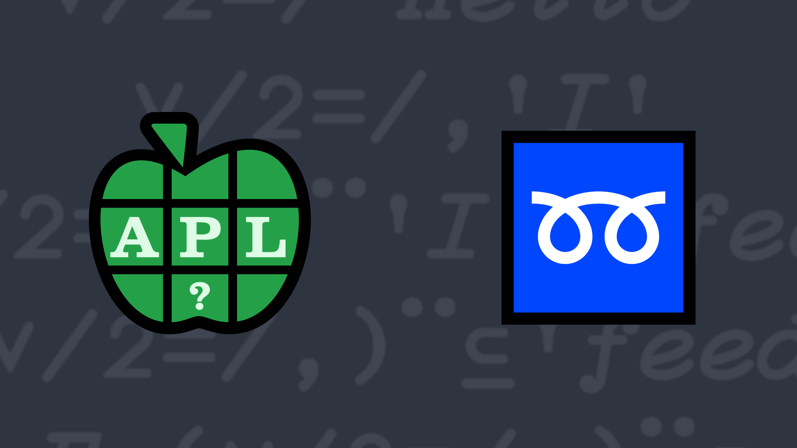

# <span class=s>2019-</span>5: Doubling Up
<!-- Write a function that, given a word or a list of words, returns a Boolean vector where `1` indicates a word with one or more consecutive duplicated, case-sensitive, letters. -->
Given a word or a list of words, return a Boolean vector where `1` indicates a word with one or more consecutive duplicated, case-sensitive, letters. Each word will have at least one letter and will consist entirely of either uppercase (A–Z) or lowercase (a–z) letters. Words consisting of a single letter can be scalars.

💡 Hint: The nest function [`⊆Y`](http://help.dyalog.com/latest/Content/Language/Primitive%20Functions/Nest.htm) could be useful.

### Examples

```APL
      (your_function) 'I' 'feed' 'the' 'bookkeeper'
0 1 0 1
      (your_function) 'I'
0
      (your_function) 'feed'
1
      (your_function) 'MY' 'LLAMAS' 'HAVE' 'BEEN' 'GOOD'
0 1 0 1 1 
```
<div class="pdiv">
  <code onclick="p_Input.focus()">your_function ← </code><input id="p_Input" autocomplete="off" spellcheck="false" oninput="this.parentElement.querySelector`button`.disabled=false;localStorage.setItem(window.location.pathname,this.value)" onkeypress="subm(event)">
  <button onclick="alert$.next`Testing…`;submitSolution`p`" class="md-button md-button--primary">&#x2714; Test</button>
</div>
<blockquote id="p_Output"></blockquote>
## Solutions
<div onclick="play(this)" title="Video on YouTube" class="yt">


</div>
<a href="https://chat.stackexchange.com/transcript/52405?m=63469882#63469882" target="_blank" class="md-button md-button--primary">Chat transcript</a>
<a href="https://github.com/dyalog/apl.quest/tree/main/2019/5.apl" target="_blank" class="md-button md-button--primary right">Code on GitHub</a>

<script>
    testCases={"a":[",¨'I' 'feed' 'the' 'bookkeeper'","⎕A","2/⎕A","'blabla' 'blibli'","'oo' 'zzz' 'baaah'","{'abc'[?15⍴3]}¨⍳2+?2"],"b":["'I' 'feed' 'the' 'bookkeeper'","'I'",",'I'","'feed'",",⊂'feed'"],"f":"{{∨/2=/,⍵}¨,⊆,⍵}","p":","}
    p_Input.value=localStorage.getItem(window.location.pathname)
    play=e=>e.outerHTML=`<iframe src="https://www.youtube.com/embed/c8XRnJeJ2AY?list=PLYKQVqyrAEj9wDIUyLDGtDAFTKY38BUMN&autoplay=1" title="<span class=s>2019-</span>5: Doubling Up (APL Quest 2019-5)" frameborder="0" allow="accelerometer; autoplay; clipboard-write; encrypted-media; gyroscope; picture-in-picture; web-share" referrerpolicy="strict-origin-when-cross-origin" allowfullscreen></iframe>`
</script>
