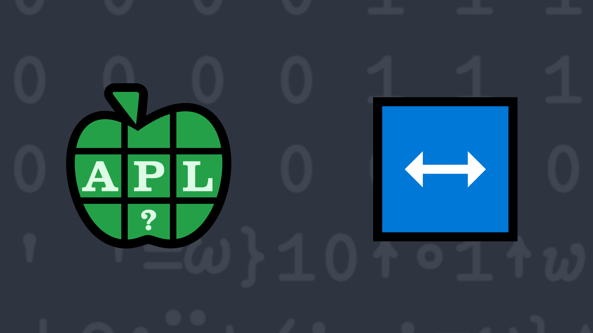

# <span class=s>2019-</span>7: In the Center of It All
<!-- Write a function that, given a right argument of a list of words (or possibly a single word) and a left argument of a width, returns a character matrix that has width columns and one row per word, where each word is centered within the row. -->
Given a right argument of a list of words (or possibly a single word) and a left argument of a width, return a character matrix that has width columns and one row per word, where each word is centered within the row. If width is smaller than the length of a word, truncate the word from the right. If there are an odd number of spaces to center within, leave the extra space on the right.

💡 Hint: The mix [`↑Y`](http://help.dyalog.com/latest/Content/Language/Primitive%20Functions/Mix.htm) and rotate [`X⌽Y`](http://help.dyalog.com/latest/Content/Language/Primitive%20Functions/Rotate.htm) functions will probably be useful here.

### Examples:

```APL
      10 (your_function) 'APL' 'Problem' 'Solving' 'Competition'
   APL   
 Problem   
 Solving  
Competitio
      3 (your_function) 0⍴⊂''   ⍝ result should be 0-row, 3-column matrix      
```
<div class="pdiv">
  <code onclick="p_Input.focus()">your_function ← </code><input id="p_Input" autocomplete="off" spellcheck="false" oninput="this.parentElement.querySelector`button`.disabled=false;localStorage.setItem(window.location.pathname,this.value)" onkeypress="subm(event)">
  <button onclick="alert$.next`Testing…`;submitSolution`p`" class="md-button md-button--primary">&#x2714; Test</button>
</div>
<p id="p_Output"></p>
## Solutions
<div onclick="play(this)" title="Video on YouTube" class="yt">

<time>6:56</time>

</div>
<a href="https://chat.stackexchange.com/transcript/52405?m=63558554#63558554" target="_blank" class="md-button md-button--primary">Chat transcript</a>
<a href="https://github.com/abrudz/apl_quest/tree/main/2019/7.apl" target="_blank" class="md-button md-button--primary right">Code on GitHub</a>

<script>
    testCases={"a":[["10","'APL' 'Problem' 'Solving' 'Competition'"],["?15","{(⎕A,819⌶⎕A)[?⍴⍨⍵]⊂⍨(⍳⍵)∊⍵?⍨3+?7}52"]],"b":[["3+?10","'APL'"],["?10",",⊂'Competition'"],["?15","0⍴⊂''"]],"f":"{{⍵⌽⍨⌈¯0.5×⍵+.=' '}↑⍺↑¨,⊆,⍵}","p":"{⎕FMT'.*'⎕R'&'⍠'EOL' 'CR'⍠'NEOL'1↑⍣≡⍵}"}
    p_Input.value=localStorage.getItem(window.location.pathname)
    play=e=>e.outerHTML=`<iframe src="https://www.youtube.com/embed/Bhov522Jz7o?list=PLYKQVqyrAEj9wDIUyLDGtDAFTKY38BUMN&autoplay=1" title="<span class=s>2019-</span>7: In the Center of It All (APL Quest 2019-7)" frameborder="0" allow="accelerometer; autoplay; clipboard-write; encrypted-media; gyroscope; picture-in-picture; web-share" referrerpolicy="strict-origin-when-cross-origin" allowfullscreen></iframe>`
</script>
