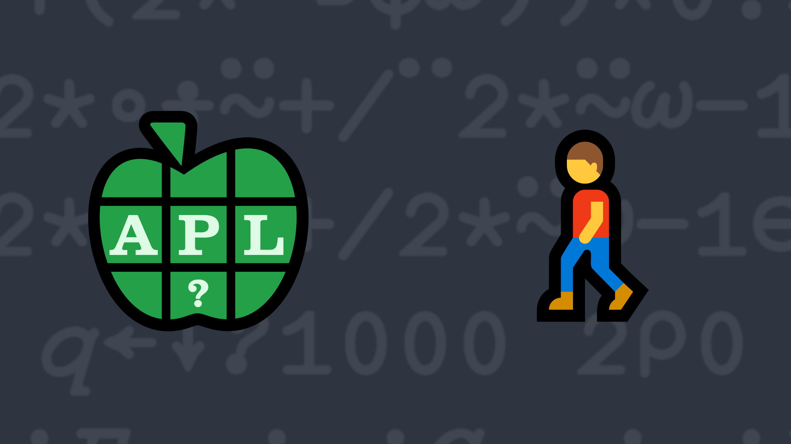

# <span class=s>2019-</span>8: Going the Distance

<svg class="left" style="max-width:300px" version="1.1" baseProfile="full" width="auto" height="auto" viewBox="0 0 3000 3950"  xmlns="http://www.w3.org/2000/svg" xmlns:xlink="http://www.w3.org/1999/xlink" xmlns:ev="http://www.w3.org/2001/xml-events" >
<desc>Created by Causeway SVG engine - SharpPlot v3.61.0</desc>
<g stroke-miterlimit="100">
<desc>Border =====</desc>
<desc>Region =====</desc>
<desc>X-Axis Ticks =====</desc>
<desc>X-Axis Grid</desc>
 <path fill="none" stroke-width="1.8" stroke="Silver" d="M400 3430L400 460M995 3430L995 460M2185 3430L2185 460M2780 3430L2780 460"/>
<desc>X-Axis tickmarks</desc>
 <path fill="none" stroke-width="7.2" stroke="Black" d="M400 2242L400 2286M995 2242L995 2286M2185 2242L2185 2286M2780 2242L2780 2286"/>
 <path fill="none" stroke-width="7.2" stroke="Black" d="M400 2242L400 2198M995 2242L995 2198M1590 2242L1590 2198M2185 2242L2185 2198M2780 2242L2780 2198"/>
<desc>Y-Axis Ticks =====</desc>
<desc>Y grid</desc>
 <path fill="none" stroke-width="1.8" stroke="Silver" d="M400 3430L2780 3430M400 2836L2780 2836M400 2242L2780 2242M400 1648L2780 1648M400 1054L2780 1054M400 460L2780 460"/>
<desc>Y-Axis tickmarks</desc>
 <path fill="none" stroke-width="7.2" stroke="Black" d="M1590 3430L1557 3430M1590 2836L1557 2836M1590 2242L1557 2242M1590 1648L1557 1648M1590 1054L1557 1054M1590 460L1557 460"/>
 <path fill="none" stroke-width="7.2" stroke="Black" d="M1623 3430L1590 3430M1623 2836L1590 2836M1623 2242L1590 2242M1623 1648L1590 1648M1623 1054L1590 1054M1623 460L1590 460"/>
<desc>Axes =====</desc>
 <path fill="none" stroke-width="12" stroke="Black" d="M1590 3474L1590 372M356 2242L2868 2242"/>
<desc>Arrowhead(s) for the axes</desc>
 <g stroke-width="12" stroke="Black" fill="Black" >
  <path d="M1590 345.9L1611.9 393 1590 377.3 1568.1 393z"/>
  <path d="M2894.1 2242L2847 2263.9 2862.7 2242 2847 2220.1z"/>
 </g>
<desc>Y-axis labels</desc>
 <g font-family="APL385" font-size="100" text-anchor="end" >
  <text x="1545" y="3460" >¯2</text>
  <text x="1545" y="2866" >¯1</text>
  <text x="1545" y="1678" >1</text>
  <text x="1545" y="1084" >2</text>
  <text x="1545" y="490" >3</text>
 </g>
<desc>for X-axis labels</desc>
 <g font-family="APL385" font-size="100" text-anchor="middle" >
  <text x="400" y="2366" >¯2</text>
  <text x="995" y="2366" >¯1</text>
  <text x="2185" y="2366" >1</text>
  <text x="2780" y="2366" >2</text>
 </g>
<desc>Heading, subheading and footnotes =====</desc>
<desc>Start of Line Chart ===========</desc>
<desc>Points follow ...</desc>
<desc>Line</desc>
 <g stroke-width="20" stroke="#928ABD" stroke-linejoin="round" stroke-linecap="round" fill="none" >
  <path d="M698 3133L2483 3133 2483 757 698 3133" />
 </g>
<desc>Data value labels ... </desc>
 <g fill="#000000" font-family="APL385" font-size="100" text-anchor="middle" >
  <text x="800" y="3240" >A←(¯1.5 ¯1.5)</text>
  <text x="2455" y="730" >B←(1.5 2.5)</text>
  <text x="2425" y="3240" >C←(1.5 ¯1.5)</text>
 </g>
<desc>Reset to original origin</desc>
</g>
</svg>
<!-- Write a function that, given a right argument of a list of words (or possibly a single word) and a left argument of a width, returns a character matrix that has width columns and one row per word, where each word is centered within the row. -->
Given a vector of `(X Y)` points, or a single `X Y` point, determine the total distance covered when travelling in a straight line from the first point to the next one, and so on until the last point, then returning directly back to the start. For example, given the points `(A B C) ← (¯1.5 ¯1.5)(1.5 2.5)(1.5 ¯1.5)`, the distance `A` to `B` is `5`, `B` to `C` is `4` and `C` back to `A` is `3`, for a total of `12`.

💡 Hint: The rotate [`X⌽Y`](http://help.dyalog.com/latest/Content/Language/Primitive%20Functions/Rotate.htm) and power [`X*Y`](http://help.dyalog.com/latest/Content/Language/Primitive%20Functions/Power.htm) functions might be useful.

### Examples

```APL
      (your_function) (1 ¯1)(1 3)   ⍝ from A to B and back to A
8
      (your_function) (1 1)(1 2)(2 2)(2 1)   ⍝ from A to B to C to D to A
4
      (your_function) 5 5   ⍝ staying where we are
0
      (your_function) (1 1)(3 3)   ⍝ there and back again
5.656854249
```
<div class="pdiv">
  <code onclick="p_Input.focus()">your_function ← </code><input id="p_Input" autocomplete="off" spellcheck="false" oninput="this.parentElement.querySelector`button`.disabled=false;localStorage.setItem(window.location.pathname,this.value)" onkeypress="subm(event)">
  <button onclick="alert$.next`Testing…`;submitSolution`p`" class="md-button md-button--primary">&#x2714; Test</button>
</div>
<blockquote id="p_Output"></blockquote>
## Solutions
<div onclick="play(this)" title="Video on YouTube" class="yt">


</div>
<a href="https://chat.stackexchange.com/transcript/52405?m=63609358#63609358" target="_blank" class="md-button md-button--primary">Chat transcript</a>
<a href="https://github.com/dyalog/apl.quest/tree/main/2019/8.apl" target="_blank" class="md-button md-button--primary right">Code on GitHub</a>

<script>
    testCases={"a":["(¯1.5 ¯1.5)(1.5 2.5)(1.5 ¯1.5)","(1 ¯1)(1 3)","(1 1)(1 2)(2 2)(2 1)","(¯5+?(2+?4)⍴⊂,⍨11)÷2*?2"],"b":["5 5",",⊂¯2 ¯4"],"f":"{+/2{.5*⍨2+.*⍨⍺-⍵}/⍵⍴⍨1+≢⍵}∘⊆","p":"{⊃⍣(1=≢,⍵)⊢⍵}"}
    p_Input.value=localStorage.getItem(window.location.pathname)
    play=e=>e.outerHTML=`<iframe src="https://www.youtube.com/embed/GNdp6rAZ2Is?list=PLYKQVqyrAEj9wDIUyLDGtDAFTKY38BUMN&autoplay=1" title="<span class=s>2019-</span>8: Going the Distance (APL Quest 2019-8)" frameborder="0" allow="accelerometer; autoplay; clipboard-write; encrypted-media; gyroscope; picture-in-picture; web-share" referrerpolicy="strict-origin-when-cross-origin" allowfullscreen></iframe>`
</script>
