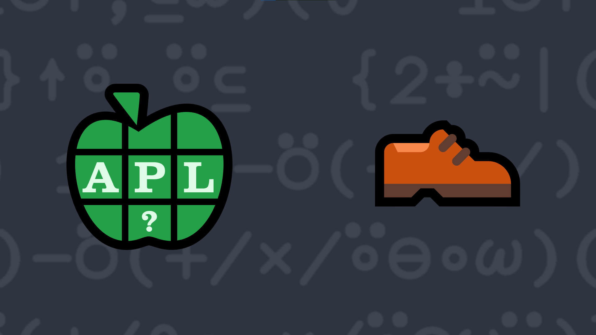

# 9: Area Code à la Gauss

Gauss's area formula, also known as [the shoelace formula](https://en.wikipedia.org/wiki/Shoelace_formula), is an algorithm to calculate the area of a simple polygon (a polygon that does not intersect itself). It's called the shoelace formula because of a common method using matrices to evaluate it. For example, the area of the triangle described by the vertices `(2 4)(3 ¯8)(1 2)` can be calculated by “walking around” the perimeter back to the first vertex, then drawing diagonals between the columns as shown below. The pattern created by the intersecting diagonals resembles shoelaces, hence the name “shoelace formula”

💡 Hint: You may want to investigate the rotate first [`X⊖Y`](http://help.dyalog.com/latest/Content/Language/Primitive%20Functions/Rotate%20First.htm) function.

<table id="shoelace">
<tbody><tr>
<td>First place the vertices in order above each other:</td>
<td>
<table class="apl">
<tbody><tr>
<td>2</td>
<td></td>
<td>4</td>
</tr>
<tr>
<td>3</td>
<td></td>
<td>¯8</td>
</tr>
<tr>
<td>1</td>
<td></td>
<td>2</td>
</tr>
<tr>
<td>2</td>
<td></td>
<td>4</td>
</tr>
</tbody></table>
</td>
</tr>
<tr>
<td>
      Sum the products of the numbers connected by the diagonal lines going down and to the right:<p></p>
<pre>      (2ׯ8)+(3×2)+(1×4)
¯6
      </pre>
</td>
<td>
<table class="apl">
<tbody><tr>
<td>2</td>
<td class="nwse">│</td>
<td>4</td>
</tr>
<tr>
<td>3</td>
<td class="nwse">│</td>
<td>¯8</td>
</tr>
<tr>
<td>1</td>
<td class="nwse">│</td>
<td>2</td>
</tr>
<tr>
<td>2</td>
<td></td>
<td>4</td>
</tr>
</tbody></table>
</td>
</tr>
<tr>
<td>
      Next sum the products of the numbers connected by the diagonal lines going down and to the left: <p></p>
<pre>      (4×3)+(¯8×1)+(2×2)
8
      </pre>
</td>
<td>
<table class="apl">
<tbody><tr>
<td>2</td>
<td class="swne">│</td>
<td>4</td>
</tr>
<tr>
<td>3</td>
<td class="swne">│</td>
<td>¯8</td>
</tr>
<tr>
<td>1</td>
<td class="swne">│</td>
<td>2</td>
</tr>
<tr>
<td>2</td>
<td></td>
<td>4</td>
</tr>
</tbody></table>
</td>
</tr>
<tr>
<td> <!------------------------------------------><br>
      Finally, halve the absolute value of the difference between the two sums:  <p></p>
<pre>      0.5 × | ¯6 - 8
7
      </pre>
</td>
<td>
<table class="apl">
<tbody><tr>
<td>2</td>
<td class="swne last">│</td>
<td class="nwse">│</td>
<td>4</td>
</tr>
<tr>
<td>3</td>
<td class="swne last">│</td>
<td class="nwse">│</td>
<td>¯8</td>
</tr>
<tr>
<td>1</td>
<td class="swne last">│</td>
<td class="nwse">│</td>
<td>2</td>
</tr>
<tr>
<td>2</td>
<td></td>
<td></td>
<td>4</td>
</tr>
</tbody></table>
</td>
</tr>
</tbody></table>

Given a vector of `(X Y)` points, or a single `X Y` point, return a number indicating the area circumscribed by the points.

### Examples

```APL
      (your_function) (2 4)(3 ¯8)(1 2)
7
      (your_function) (1 1)   ⍝ a point has no area
0
      (your_function) (1 1)(2 2)   ⍝ neither does a line
0
```

</div>   
<div class="pdiv">
  <code>your_function ← </code><input id="p_Input" autocomplete="off" spellcheck="false" oninput="this.parentElement.querySelector`button`.disabled=false" onkeypress="subm(event)">
  <button onclick="alert$.next`Testing…`;submitSolution`p`" class="md-button">&#x2714; Test</button>
</div>
<blockquote id="p_Output"></blockquote>
<div onclick="play(this)" title="Video on YouTube" class="yt">


</div>
<a href="https://chat.stackexchange.com/transcript/52405?m=63718568#63718568" target="_blank" class="md-button">Chat transcript</a>
<a href="https://github.com/abrudz/apl_quest/tree/main/2019/9.apl" target="_blank" class="md-button right">Code on GitHub</a>

<script>
    testCases={"a":["(2 4)(3 ¯8)(1 2)","↓¯10+?3 2⍴21",",⌿9 11∘.○{⌽⍣(?2)⊢(?≢⍵)⌽⍵[⍋12○⍵]}⌊0.5+(⊢×∘?15⍴⍨≢)¯12○○10÷⍨(3+?6)?10"],"b":["(1 1)","(1 1)(2 2)"],"f":"{{.5×|-/+⌿⍵×1⊖⌽⍵}↑,⊆⍵}","p":"{⊃⍣(1=≢,⍵)⊢⍵}"}
    play=e=>e.outerHTML=`<iframe src="https://www.youtube.com/embed/njZs8HV5Ra0?list=PLYKQVqyrAEj9wDIUyLDGtDAFTKY38BUMN&autoplay=1" title="9: Area Code à la Gauss (APL Quest 2019-9)" frameborder="0" allow="accelerometer; autoplay; clipboard-write; encrypted-media; gyroscope; picture-in-picture; web-share" referrerpolicy="strict-origin-when-cross-origin" allowfullscreen></iframe>`
    p_Input.focus()
</script>
