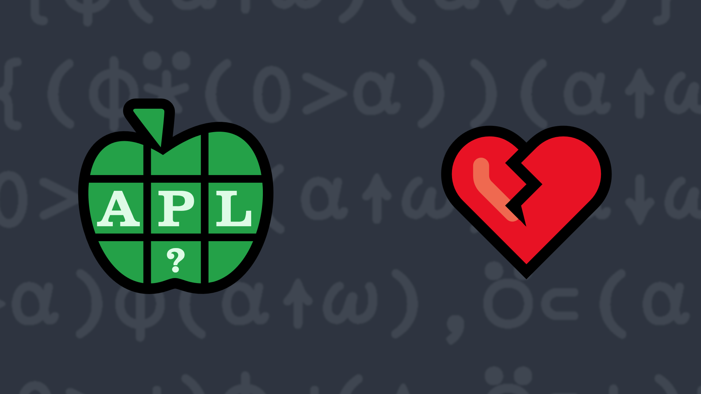

# <span class=s>2020-</span>1: Let's Split!
<!-- Write a function that, given a right argument `Y` which is a scalar or a non-empty vector and a left argument `X` which is a single non-zero integer so that its absolute value is less or equal to `≢Y`, splits `Y` into a vector of two vectors according to `X`. -->
Write a function that, given a right argument `Y` which is a scalar or a non-empty vector and a left argument `X` which is a single non-zero integer so that its absolute value is less or equal to `≢Y`, splits `Y` into a vector of two vectors according to `X`, as follows:
- If `X>0`, the first vector contains the first `X` elements of `Y` and the second vector contains the remaining elements.
- If `X<0`, the second vector contains the last `|X` elements of `Y` and the first vector contains the remaining elements.

💡 Hint: The Take function [`X↑Y`](http://help.dyalog.com/latest/#Language/Primitive%20Functions/Take.htm) might be useful for this problem.

### Examples:

```APL
      9 (your_function) 'SplittingHairs'   ⍝ using ]Boxing on
┌─────────┬─────┐
│Splitting│Hairs│
└─────────┴─────┘

      ¯3 (your_function) 'DyalogAPL'
┌──────┬───┐
│Dyalog│APL│
└──────┴───┘

      10 (your_function) ⍳10
┌────────────────────┬┐
│1 2 3 4 5 6 7 8 9 10││
└────────────────────┴┘

      1 (your_function) 'works' 'with' 'words' 'also'
┌───────┬─────────────────┐
│┌─────┐│┌────┬─────┬────┐│
││works│││with│words│also││
│└─────┘│└────┴─────┴────┘│
└───────┴─────────────────┘
```
<div class="pdiv">
  <code onclick="p_Input.focus()">your_function ← </code><input id="p_Input" autocomplete="off" spellcheck="false" oninput="this.parentElement.querySelector`button`.disabled=false;localStorage.setItem(window.location.pathname,this.value)" onkeypress="subm(event)">
  <button onclick="alert$.next`Testing…`;submitSolution`p`" class="md-button md-button--primary">&#x2714; Test</button>
</div>
<p id="p_Output"></p>
## Solutions
<div onclick="play(this)" title="Video on YouTube" class="yt">

<time>6:11</time>

</div>
<a href="https://chat.stackexchange.com/transcript/52405?m=63767556#63767556" target="_blank" class="md-button md-button--primary">Chat transcript</a>
<a href="https://github.com/abrudz/apl_quest/tree/main/2020/1.apl" target="_blank" class="md-button md-button--primary right">Code on GitHub</a>

<script>
    testCases={"a":[["9","'SplittingHairs'"],["¯3","'DyalogAPL'"],["1","'works' 'with' 'words' 'also'"],["?9","?⍨9"]],"b":[["1","2"],["¯1","?100"],["10","⍳10"],["¯10","⍳10"],["1","⊂'word'"],["¯1","⊂'word'"]],"f":"{(⍺<0)⌽(⍺↑⍵)(⍺↓⍵)}","p":"⊢"}
    p_Input.value=localStorage.getItem(window.location.pathname)
    play=e=>e.outerHTML=`<iframe src="https://www.youtube.com/embed/2grlocFykmI?list=PLYKQVqyrAEj9wDIUyLDGtDAFTKY38BUMN&autoplay=1" title="<span class=s>2020-</span>1: Let's Split! (APL Quest 2020-1)" frameborder="0" allow="accelerometer; autoplay; clipboard-write; encrypted-media; gyroscope; picture-in-picture; web-share" referrerpolicy="strict-origin-when-cross-origin" allowfullscreen></iframe>`
</script>
