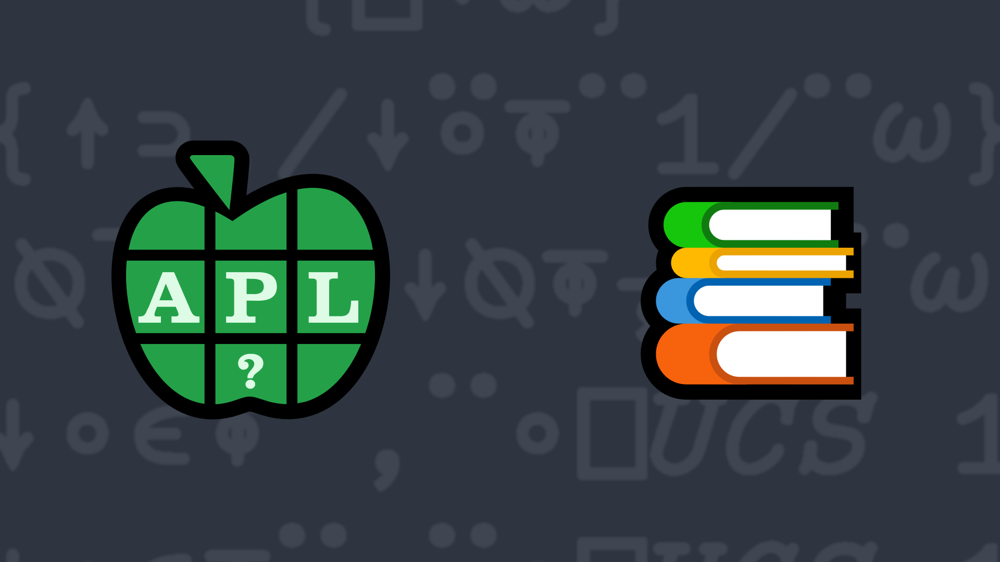

# 10: Stacking It Up
Write a function that takes as its right argument a vector of simple arrays of rank 2 or less (scalar, vector, or matrix). Each simple array will consist of either non-negative integers or printable ASCII characters. The function must return a simple character array that displays identically to what `{⎕←⍵}¨` displays when applied to the right argument.

💡 Hint: The *Mix* [`↑Y`](https://help.dyalog.com/latest/#Language/Primitive%20Functions/Mix.htm), *Split* [`↓Y`](https://help.dyalog.com/latest/#Language/Primitive%20Functions/Split.htm), and *Format* [`⍕Y`](https://help.dyalog.com/latest/#Language/Primitive%20Functions/Format%20Monadic.htm) functions could be helpful for solving this problem.

### Examples
All results will look identical with `]Boxing on` as they are simple (non-nested) character arrays.

```APL
      (your_function) 'Hi' 'Earth'
Hi   
Earth

      (your_function) (3 3⍴⍳9)(↑'Adam' 'Michael')(⍳10) '*'(5 5⍴⍳25)
1 2 3               
4 5 6               
7 8 9               
Adam                
Michael             
1 2 3 4 5 6 7 8 9 10
*                   
 1  2  3  4  5      
 6  7  8  9 10      
11 12 13 14 15      
16 17 18 19 20      
21 22 23 24 25

      (your_function) 'O' 'my!'
O  
my!

      (your_function) ,⊂⍳4
1 2 3 4

      (your_function) ,'A'
A
```
<div class="pdiv">
  <code>your_function ← </code><input id="p_Input" autocomplete="off" spellcheck="false" oninput="this.parentElement.querySelector`button`.disabled=false" onkeypress="subm(event)">
  <button onclick="alert$.next`Testing…`;submitSolution`p`" class="md-button">&#x2714; Test</button>
</div>
<blockquote id="p_Output"></blockquote>
<div onclick="play(this)" title="Video on YouTube" class="yt">


</div>
<a href="https://chat.stackexchange.com/transcript/52405?m=64172099#64172099" target="_blank" class="md-button">Chat transcript</a>
<a href="https://github.com/abrudz/apl_quest/tree/main/2020/10.apl" target="_blank" class="md-button right">Code on GitHub</a>

<script>
    testCases={"a":["'Hi' 'Earth'","0 'my!'","'O' 'my!'","'a'(⍪42)","(3 2⍴⍳6)(↑'Ad' 'Mich')(⍳4)'*'(2 3⍴⍳6)","⎕A[4?10](⍉5 2⍴2*⍳10)'a'"],"b":["'a'0",",⊂'abcd'",",⊂,42",",⊂'abc'",",⊂⍪'abc'",",⊂⍪3 14",",⊂⍪'a'",",⎕A[?26]","(3 2⍴0)(↑' A ' ' M  ')(4⍴0)' '(2 3⍴0)","'abc'"],"f":"{⍉1↓¯1↓⍉⍕⍪1/¨⍵}","p":"{⎕FMT⎕UCS 13@(=∘10)⎕UCS⍵}"}
    play=e=>e.outerHTML=`<iframe src="https://www.youtube.com/embed/LBelbuN1yRo?list=PLYKQVqyrAEj9wDIUyLDGtDAFTKY38BUMN&autoplay=1" title="10: Stacking It Up (APL Quest 2020-10)" frameborder="0" allow="accelerometer; autoplay; clipboard-write; encrypted-media; gyroscope; picture-in-picture; web-share" referrerpolicy="strict-origin-when-cross-origin" allowfullscreen></iframe>`
    p_Input.focus()
</script>
