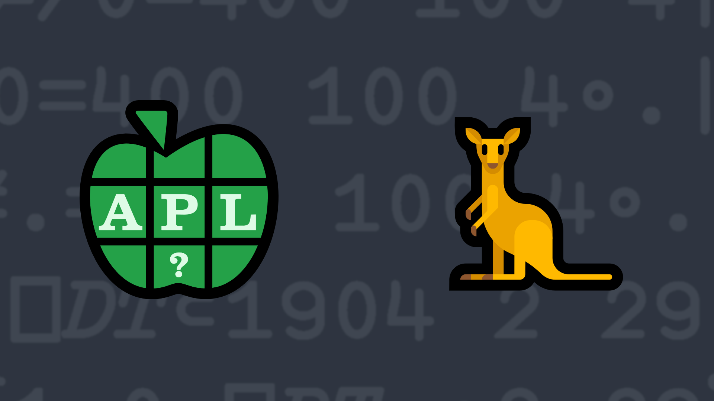

# <span class=s>2020-</span>4: Take a Leap
Write a function that, given a right argument which is an integer array of year numbers greater than or equal to 1752 and less than 4000, returns a result of the same shape as the right argument where 1 indicates that the corresponding year is a leap year (0 otherwise).

A leap year algorithm can be found [here](https://en.wikipedia.org/wiki/Leap_year#Algorithm). 

💡 Hint: The Residue function [`X|Y`](https://help.dyalog.com/latest/#Language/Primitive%20Functions/Residue.htm) and the Outer Product operator [`∘.`](https://help.dyalog.com/latest/#Language/Primitive%20Operators/Outer%20Product.htm) could be useful for this problem.

### Examples
```APL
      (your_function) 2020
1

      (your_function) ⍬   ⍝ returns an empty vector

      (your_function) 1900+10 10⍴⍳100
0 0 0 1 0 0 0 1 0 0
0 1 0 0 0 1 0 0 0 1
0 0 0 1 0 0 0 1 0 0
0 1 0 0 0 1 0 0 0 1
0 0 0 1 0 0 0 1 0 0
0 1 0 0 0 1 0 0 0 1
0 0 0 1 0 0 0 1 0 0
0 1 0 0 0 1 0 0 0 1
0 0 0 1 0 0 0 1 0 0
0 1 0 0 0 1 0 0 0 1
```
<div class="pdiv">
  <code onclick="p_Input.focus()">your_function ← </code><input id="p_Input" autocomplete="off" spellcheck="false" oninput="this.parentElement.querySelector`button`.disabled=false;localStorage.setItem(window.location.pathname,this.value)" onkeypress="subm(event)">
  <button onclick="alert$.next`Testing…`;submitSolution`p`" class="md-button md-button--primary">&#x2714; Test</button>
</div>
<blockquote id="p_Output"></blockquote>
## Solutions
<div onclick="play(this)" title="Video on YouTube" class="yt">

<time>11:04</time>

</div>
<a href="https://chat.stackexchange.com/transcript/52405?m=63890718#63890718" target="_blank" class="md-button md-button--primary">Chat transcript</a>
<a href="https://github.com/abrudz/apl_quest/tree/main/2020/4.apl" target="_blank" class="md-button md-button--primary right">Code on GitHub</a>

<script>
    testCases={"a":["1752","1901","1904","1900","3038 2339","⍪3418 2880 3129","3999","2000+?1000"],"b":["3000","2000","⍬","⍬⊤⍬","2 0⍴0","0 2 0⍴0","0⍴⍨{0@(?≢⍵)⊢⍵}?7⍴⍨?5"],"f":"{0≠.=400 100 4∘.|⍵}","p":"⊢"}
    p_Input.value=localStorage.getItem(window.location.pathname)
    play=e=>e.outerHTML=`<iframe src="https://www.youtube.com/embed/hqyDUkSooCw?list=PLYKQVqyrAEj9wDIUyLDGtDAFTKY38BUMN&autoplay=1" title="<span class=s>2020-</span>4: Take a Leap (APL Quest 2020-4)" frameborder="0" allow="accelerometer; autoplay; clipboard-write; encrypted-media; gyroscope; picture-in-picture; web-share" referrerpolicy="strict-origin-when-cross-origin" allowfullscreen></iframe>`
</script>
